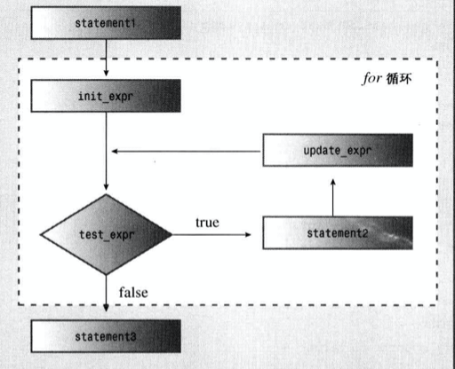
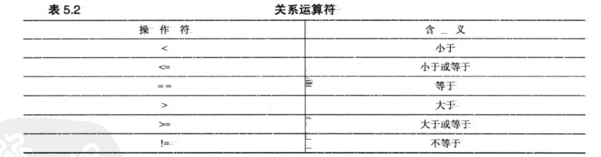
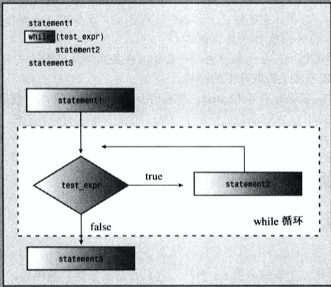

# 第五章 循环和关系表达式

### 👉【[复习题](./复习题.md)】【[编程练习题](./编程题.md)】
# 1. for循环
- for循环为执行重复的操作提供了循序渐进的过程。


- for循环是`入口条件（entry-condition）`循环。


## 1.1 for循环的组成部分
- 设置变量初始化
- 执行测试，查看循环是否继续进行。
- 执行循环操作
- 不断更新测试的值

## 1.2 for循环的通用格式
```cpp
statement01
for (initialization; test-expression; update-expression)
    statement01;
statement03;
```
> 说明：test_expression 决定了程序是否执行， 这里的表达式也就是所谓的关系表达式，即两个数进行比较。

结构示意图：



C++中常用的方式：在for和括号之间加上一个空格，而省略函数名与括号之间的空格。
```cpp
for(int i = 6;i<=12;i++);
    printf("i = %d\n",i);
```

## 1.3 `递增`运算符`(++)`和`递减`运算符`(--)`
- 递增/递减：增加/减少一个单位

- 前缀和后缀的区别
    - **前缀递增/递减**：表示`操作符（++/--）`位于变量或表达式的`前面`。
    > 先执行运算，再生成值。
    - **后缀递增/递减**：表示`操作符（++/--）`位于变量或表达式的`后面`。
    > 先生成值，在执行运算。
    
    ```cpp
    int x = 1;
    // 后缀表达式
    cout << x++ << endl;
    >>> 1
    // 前缀表达式
    cout << ++x << endl;
    >>> 2
    ```

将递增 / 递减运算符用于指针时，把指针增加/减少其指向的数据类型占用的字节数。

```cpp
 double arr[5] = {2.3,7.5,3.7,6.5,7.8};
 double *pt = arr;
 ++pt;
```

- `前缀/后缀递增 / 递减`运算符的优先级
`前缀递增、前缀递减`和`解除引用运算符`的优先级`相同`，从`左往右`的方式进行结合。

`后缀递增和后缀递减`的优先级相同，但是比`前缀运算符`的优先级`高`，从`左往右`的方式进行结合。

## 1.4 组合复制运算符
就是合并了算术运算符和赋值操作的运算符。

|操作符|作用（L为左操作数，R为右操作数）|
|:--:|:--:|
|+=|将`L+R`赋给L|
|-=|将`L-R`赋给L|
|*=|将`L*R`赋给L
|/=|将`L/R`赋给L|
|%=|将`L%R`赋给L|

## 1.5 关系表达式


> ⚠️注意：`等于`运算符（==）和`赋值`运算符（=）两者不要混淆。
>
> 比较两个量是否`相等`时，而要使用 `==`。

## 1.6 C-风格的字符串
`数组名`是数组的`地址`。用引号括起来的字符串常量也是其地址。

C-风格字符串库中的`strcmp()`函数来比较，函数接收两个字符串地址作为参数（参数可以是指针、字符串常量或字符数组名）。

- 如果字符串相同，函数返回 0；


- 如果第一个字符串按字母顺序排在第二个字符串`之前`，则`strcmp()`函数返回一个`负值`。


- 如果第一个字符串按字母顺序排在第二个字符串`之后`，则`strcmp()`函数返回一个`正值`。

## 1.7 for-each

```cpp
int num[5] = {1, 2, 3, 4, 5};
for (int i: num) {
    cout << i << endl;
}
for (int &x: num) { // &x 是引用，不是指针
    x = x * 2;  // 可以修改数组的值
    cout << x << endl;
}
```


# 2. while循环

while循环是`没有初始化` 和 `更新部分` 的for循环。只有`测试条件` 和 `循环体`。

## 2.1 while循环的语法格式
```cpp
while(test-condition)
    loop-body
```

## 2.2 字符串循环

- `while(name[i])`

```cpp
char name[ArSize] = "Bayyy";
int i = 0;
while (name[i] != '\0')     // process to end of string
{
    cout << name[i] << ": " << int(name[i]) << endl;
    i++;                    // don't forget this step
}
i = 0;
while (name[i])
{
    cout << name[i] << ": " << int(name[i]) << endl;
    i++;
}
```

## 2.3 for-while替换

### 2.3.1 for->while

```cpp
// for
for (init - expression; test - expression; update - expression)
{
    statement(s);
}

// while
init - expression;
while (test - expression)
{
    statement(s);
    update - expression;
}
```

### 2.3.2 while->for

```cpp
// while
while (test-expression)
{
    body;
}

// for
for (;test-expression;)
{
    body;
}
```

## 2.4 延时循环

- ctime(time.h)
  - 定义了一个符号常量——`CLOCKS_PER_SEC`
  - 将 `clock_t` 作为 `clock()` 返回类型的别名

```cpp
#include <iostream>
#include <ctime> // describes clock() function, clock_t type
int main()
{
    clock_t delay = 10 * CLOCKS_PER_SEC;  // convert to clock ticks
    clock_t start = clock();
    while (clock() - start < delay )        // wait until time elapses
        ;                                   // note the semicolon
    cout << "done \a\n";
    return 0; 
}
```

## 2.5 while循环的结构图



# 3. do while循环

- 语法

```cpp
do
{
    body;
} while (test-expression);
```

# 4. 循环与文本输入

## 4.1 cin

`cin` 会忽略空格和换行符，且只有用户按下回车符后，输入的内容才会发给程序

## 4.2 cin.get()

- `cin.get(char)` 读取包含空格的字符

  - 其将参数char声明为引用，故可以修改值

- `cin.get()` 重载

- | 属性                       | `cin.get(ch)`                        | `ch=cin.get()`      |
  | -------------------------- | ------------------------------------ | ------------------- |
  | 传递输入字符的方式         | 幅值参数 `ch`                        | 将函数返回值赋给 ch |
  | 用于字符输入时函数的返回值 | `istream`对象(执行bool转换后为true)  | int类型的字符编码   |
  | 到达EOF时函数的返回值      | `istream`对象(执行bool转换后为false) | EOF                 |

## 4.3 EOF

```cpp
while (cin.fail() == false)
{
    ...
}
```

- `cin.clear()` 方法可以清除EOF标记

- 可以替换为

  - ```cpp
    while (!cin.fail())
    ```

    - `cin.get(char)` 返回一个cin对象

      - ```cpp
        while (cin)
        ```

      - ```cpp
        while (cin.get(ch))
        ```

## 4.4 cin.get()

# 5. 循环嵌套和二维数组

```cpp
const char * cities[Cities] =   // array of pointers
{                               // to 5 strings
    "Gribble City",
    "Gribbletown",
    "New Gribble",
    "San Gribble",
    "Gribble Vista"
};

int maxtemps[Years][Cities] =   // 2-D array
{
    {96, 100, 87, 101, 105},   // values for maxtemps[0]
    {96, 98, 91, 107, 104},   // values for maxtemps[1]
    {97, 101, 93, 108, 107}, // values for maxtemps[2]
    {98, 103, 95, 109, 108}   // values for maxtemps[3]
};
```

# 总结：设计循环的指导原则
- 指定循环终止的条件
- 在首次测试之前初始化条件
- 在条件被再次测试之前更新条件。

