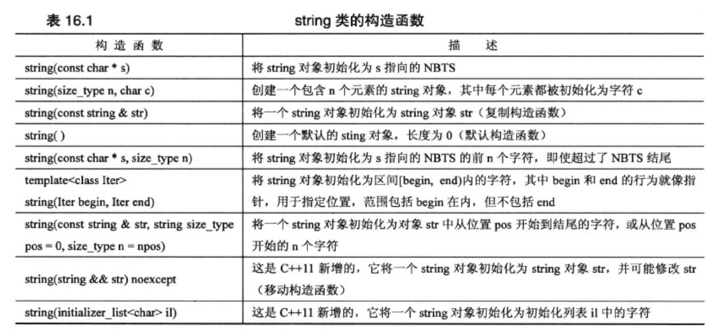
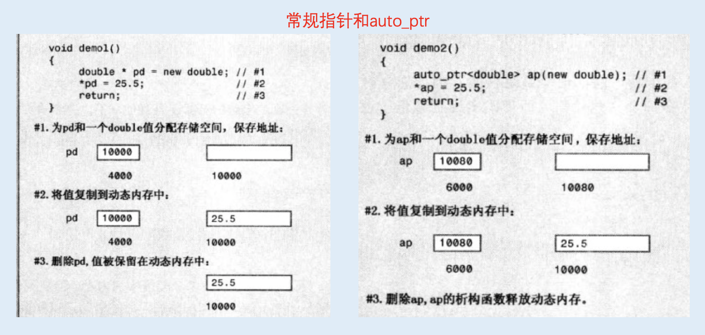

<h1 align="center">第 16 章 string类和标准模板库 学习笔记</h1>

- [1. string类](#1-string类)
  - [1.1 构造字符串](#11-构造字符串)
  - [1.2 string类输入](#12-string类输入)
  - [1.3 使用字符串](#13-使用字符串)
  - [1.4 字符串的额外函数方法](#14-字符串的额外函数方法)
  - [1.5 字符串种类](#15-字符串种类)
- [2. 智能指针模板类型](#2-智能指针模板类型)
  - [2.1 使用`智能指针`](#21-使用智能指针)
  - [2.2 智能指针的注意事项](#22-智能指针的注意事项)
  - [2.3 如何选择智能指针？](#23-如何选择智能指针)
- [3. 标准模板库](#3-标准模板库)
  - [3.1 模版类vector](#31-模版类vector)
  - [3.2 可对vector执行的操作](#32-可对vector执行的操作)
  - [3.3 STL对vecotr的其它操作](#33-stl对vecotr的其它操作)
- [4. 泛型编程](#4-泛型编程)
  - [4.1 为何使用迭代器？](#41-为何使用迭代器)
  - [4.2 迭代器的类型](#42-迭代器的类型)
  - [4.3 迭代器的层次结构](#43-迭代器的层次结构)
  - [4.4 概念、改进和模型](#44-概念改进和模型)
    - [4.4.1 将指针用作迭代器](#441-将指针用作迭代器)
    - [4.4.2 其它迭代器](#442-其它迭代器)
  - [4.5 容器种类](#45-容器种类)
    - [4.5.1 容器类型](#451-容器类型)
    - [4.5.2 容器概念](#452-容器概念)
    - [4.5.3 `序列（sequence）`容 器](#453-序列sequence容-器)
  - [4.6 关联容器（associative container）](#46-关联容器associative-container)
  - [4.7 无序关联容器（C++11）](#47-无序关联容器c11)
- [5. 函数对象](#5-函数对象)
  - [5.1 函数符概念](#51-函数符概念)
  - [5.2 预定义的函数符](#52-预定义的函数符)
  - [5.3 自适应函数符号和函数适配器](#53-自适应函数符号和函数适配器)
- [6. 算法](#6-算法)
  - [6.1 算法组](#61-算法组)
  - [6.2 算法的通用特征](#62-算法的通用特征)
  - [6.3 STL和string类](#63-stl和string类)
  - [6.4 函数和容器方法](#64-函数和容器方法)
- [7. 其它库](#7-其它库)
  - [7.1 vector、valarray和array](#71-vectorvalarray和array)
    - [7.1.1 vector](#711-vector)
    - [7.1.2 valarray](#712-valarray)
    - [7.1.3 array](#713-array)
  - [7.2 模板initializer_list（C++11）](#72-模板initializer_listc11)

## 1. string类
C语言在 string.h（C++中为cstring）提供了一系列的字符串函数。
### 1.1 构造字符串
`string` 实际上是`模板具体化 basic_string<char>` 的一个 `typedef`，同时省略了与内存管理相关的参数。



- `size_type` 依赖于实现的整型，是在`头文件 string`中定义的。
- `string类` 将`string::npos`定义为字符串的最大长度，通常为 `unsigned int`的最大值。
   

### 1.2 string类输入
在C-风格字符串，有3种方式：
```cpp
char info[100];
cin >> info;            // 读取字符
cin.getline(info,100); // 整行读取，舍弃 \n
cin.get(info,100);      // 整行读取，保留 \n
```
对于string对象，有2种方式：
```cpp
string stuff;
cin >> stuff;       // 读取字符
getline(cin,stuff); // 读取整行内容，舍弃\n
```
两个版本的getline() 都有一个可选参数，用于指定使用某个字符来确定输入的边界。
```cpp
// 读到 : 就舍弃 :
cin.getline(info,100,':');
getline(stuff,':');
```

对于string版本的`getline()` 函数从输入`读取字符`，并将其存储到`string对象`中，直到发生三种情况之一：
- 读到`文件尾`
  - 输入流的`eofbit`将被设置，其对应的方法 `fail()` 和 `eof()` 都会返回true。
- 遇到`分界字符`（默认是`\n`）
  - 删除分界符，不存储
- 读取的`字符数达到最大允许值`（string::nops 和可供分配的内存字节数中较小的一个）
  - 设置输入流中的 eofbit，让其方法 fail() 返回 true。

输入流对象有一个`统计系统`，用于跟踪流的错误状态。
- 系统中如果检测到`文件尾`后将设置 `eofbit寄存器`
- 检测到`输入错误`时将设置 `failbit寄存器`
- 出现`无法识别的故障`时将设置 `badbit寄存器`。
- `一切顺利`则设置 `goodbit寄存器`。

### 1.3 使用字符串
string类对象对全部 6个关系运算符都进行了重载。
- 如果在机器序列中，一个对象位于另一个对象的前面，则前者小于后者
- 如果机器序列为ASCII码，则小写数字大于大写字符。

通过确定`字符串的长度`来比较大小，使用 `size()` 和 `length()` 成员函数返回字符串中的`字符数`。
```cpp
if (snake1.length() == snake2.size())
    cout << "both strings have the same lengt \n";
```

在字符串中搜索给定的子字符串或字符。
|方法原型|方法描述|
|:--|:--|
|`size_type find(const string &str, size_type pos = 0) const`|从字符串的pos位置开始，查找子字符串str，如果找到，则返回子字符串首次出现时其首字符的索引，否则返回 `string::npos`|
|`size_type find(const char * s,size_type pos = 0)const`|从字符串的pos位置开始，查找子字符串s，如果找到，则返回子字符串首次出现时其首字符的索引，否则返回 `string::npos`|
|`size_type find(const char *s,size_type pos = 0,size_type n)`|从字符串的pos位置开始，查找s的前n个字符组成的子字符串，如果找到，则返回子字符串首次出现时其首字符的索引，否则返回 `string::npos`|
|`size_type find(char ch, size_type pos = 0)const`|从字符串的pos位置开始，查找字符串ch，如果找到，则返回字符出现的`位置`，否则返回 `string::npos`|

string库提供了相关的方法（其重载函数特征标都与`find()` 方法相同。）：
- `rfind()`：查找子字符串或字符最后一次出现的位置。
- `find_first_of()`：在字符串中查找参数中任何一个字符`首次出现`的位置。
- `find_last_of()`：在字符串中查找参数中任何一个字符`最后一次出现`的位置。
- `find_first_not_of()`：在字符串中查找`不在参数`中的字符`第一次出现`的位置。
-  `find_last_not_of()`：在字符串中查找`不在参数`中的字符`最后一次出现`的位置。

`+=运算符`的某个重载版本使得能够将`一个字符`附加到`字符串`中。

### 1.4 字符串的额外函数方法
- `capacity()`：返回当前分配给字符串的内存块的大小。
- `reserve()`：能够请求内存块的最小长度。

### 1.5 字符串种类
string类看作是基于char类型模板的具体化
```cpp
// Allocator 是管理内存分配的类，对于各种字符类型，都有预定义的allocator模板具体化，都是默认的，使用new和delete。
template <class charT, class traits = char _traits<charT>,
        class Allocator = allocator<charT> > 
basic_string {...};
```
模板 basic_string 有4个具体化，每一具体化都有一个 typedef名称：
```cpp
typedef basic_string<char> string;
typedef basic_string<wchar_t> wstring;
typedef basic_string<char16_t> u16string; // C++11
typedef basic_string<char32_t> u32string; // C++11
```


## 2. 智能指针模板类型
智能指针是行为类似于指针的`类对象`。

目的：将开发者将申请未释放的`内存回收`，从而`避免内存泄漏`。

### 2.1 使用`智能指针`
智能指针类一共有3种：
- `auto_ptr`
- `unique_ptr`
- `shared_ptr`

通过`new`获得（直接或间接）的`地址`赋给`对象`。当智能指针过期时，其`析构函数`将使用`delete`来`释放内存`。

如果将`new`返回的地址赋给对象后，无需关注释放内存。当智能指针过期时，内存将`自动释放`。

`auto_ptr` 和`常规指针`在行为方面的差别：`share_ptr` 和 `unique_ptr` 的行为 和 `auto_ptr` 相同。



使用常规指针实现：
```cpp
void remodel(std::string &str)
{
  std::string * ps = new std::string(str);
  ...
  if(weird_thing())
    throw exception();
  str = *ps;
  // 如果出现异常，delete不会被执行，会导致内存泄漏
  delete ps;
  return;
}
```
使用智能指针的3个步骤：
- 包含`头文件memory`
- 将指向`string的指针`替换为`指向string的智能指针对象`
- 删除`delete`语句

所以将remodel()函数使用智能指针重写为：
```cpp
#include <memory>
void remodel(std::string & str)
{
  std::auto_ptr <std::string> ps (new std::string(str));
  ...
  if (weird_thing())
    throw exception();
  str = *ps;
  // 不需要delete ps;语句
  return;
}
```

[书中代码示例](smrtsptrs.cpp)

### 2.2 智能指针的注意事项
- `auto_ptr` 和 `unique_ptr` 都是采用所有权模型。
- `unique_ptr`时，程序不会等到运行阶段崩溃，而是在编译器阶段就出现错误。
- 使用引用计数的shared_ptr是绝对稳定安全。

```cpp
// auto_ptr 会在运行阶段出现 segmentation fault (core dumped)
auto_ptr<string> p1 (new string("auto"));
auto_ptr<string p2>;
p2 = p1; // p2会接管string对象的所有权后，p1的所有权会被剥夺

// unique_ptr 会在编译阶段出现 segmentation fault (core dumped)
unique_ptr<string> p3 (new string("unique"));
unique_ptr<string p4>;
p4 = p3;
```
所以 `unique_ptr` 相对比 `auto_ptr` 更加安全。可以直接就在编译阶段解决在运行阶段会出现的潜在问题。

⚠️ **`重要的注意点`**：
- 使用`new分配内存`时，才能使用`auto_ptr`和`shared_ptr`，使用`new[ ]分配内存`时，`不能使用`它们；
- `不使用new`分配内存时，不能使用`auto_ptr`或`shared_ptr`；
- `不使用new`或`new[ ]`分配内存时，不能使用`unique_ptr`。

`unique_ptr` 可以用于数组的变体。


### 2.3 如何选择智能指针？
- **`unique_ptr`**：程序`不需要`多个指向同一个对象的指针。
  - 如果编译器没有`unique_ptr`，可以使用 `Boost库` 中的`scoped_ptr`。
- **`shared_ptr`**：程序`需要`使用多个指向同一个对象的指针。
  - 指针数组中使用辅助指针来标识特定的元素。
  - 两个对象包含都指向第三个对象的指针
  - STL容器包含指针
  - 如果编译中没有`shared_ptr`，可使用`Boost库`提供的`shared_ptr`。
- **`auto_ptr`**：在满足`unique_ptr`要求的条件时，也可使用`auto_ptr`，但`unique_ptr`是更好的选择。

## 3. 标准模板库
STL提供的模板
- 容器：一个与数组类似的单元，可以存储若干个值。STL容器是同质，即`存储的值的类型相同`。
- 迭代器：用来`遍历容器的对象`，与可遍历数组的指针类似，是`广义指针`。
- 函数对象：类似`函数对象`，可以是`类对象`或者`函数指针`。
- 算法：完成`特定任务`处方。

### 3.1 模版类vector
STL通过在头文件vector中定义了vector模板，使其类成为通用的。

创建vector模板对象，使用通常的 <type> 表示法来指出要使用的类型。vector模板使用动态内存分配，所以可以用初始化参数来指出多少矢量。
```cpp
#include <vector>
vector<int> rating(5);
int n;
cin >> n;
vector<double> scores(n);
```  
使用 `[] 运算符`来访问 vector元素。


### 3.2 可对vector执行的操作
- `size()`：返回容器中元素数目
- `swap()`：交换两个容器的内容
- `begin()`：返回一个指向容器中第一个元素的迭代器
- `end()`：返回一个表示超过容器尾的迭代器。

迭代器：一个广义指针。每个容器类都定义了一个合适的迭代器，迭代器的类型为：iterator 的 typedef，其作用域为整个类。

声明一个迭代器变量的语法如下：

```cpp
vector<double>::iterator pd; // pd 是迭代器
vector<double> scores;
// 迭代器的可进行的两个操作
pd = scores.begin();
*pd = 22.3; // 使用 * 来解引用
++pd;       // 使用 ++ 使得指针指向下一个元素
```

- `push_back()`：将元素添加到vector结尾。
- `erase()`：删除vector中给定区间的元素。
  - 接受两个参数：
    - 起始位置
    - 终点位置
  - 区间为左闭右开。
- `insert()`：插入元素
  - 接受3个参数
    - 指定新元素的插入位置
    - 第二个和第三个为被插入区间。

### 3.3 STL对vecotr的其它操作
STL从更广泛的角度定义了`非成员函数`来执行这些操作，即不是为了每个容器而定义一个`find()成员函数`，而是定义了一个适用于`所有容器类`的`非成员函数find()`。这种设计理念省去了大量重复的工作。

3个具有代表性的STL函数：
- `for_each()`
  - 可用于很多个容器类，接受3个参数：
    - 前两个是定义容器中`区间的迭代器`
    - 最后一个`指向函数的指针`，普遍一般说最后一个参数是`函数对象`。
  - `for_each()` 函数将被指向的函数用于`容器区间中的各个元素`
  - 被指向的函数`不能修改容器元素的值`
  - 可以使用 `for_each()` 函数来代替 `for循环`。

  ```cpp
  #include<vector>
  struct Review{
    std::string title;
    int rating;
  };
  vector<Review> book;
  vector<Review>::iterator pr;
  vector<Review>::iterator pr;
  for (pr = books.begin(); pr != books.end();pr++)
    ShowReview(*pr);

  // 使用for_each修改为：
  for_each(books.begin(),books.end*()); // 可以避免显式地使用迭代器变量
  ```

- `random_shuffle()`
  - 接受两个指定区间的迭代器参数，并随机排列区间中的元素。
    ```cpp
    random_shuffle(books.begin(),books.end());
    ```
  - 要求容器类允许随机访问，例如vector类。

- `sort()`
  - 也要求容器支持随机访问。
  - 函数的两个版本：
    - 版本1:接受2个定义区间的迭代器参数，并使用为存储在容器中的类型元素定义的`<运算符`，对区间中元素进行操作。
      ```cpp
      // 使用内置的<运算符
      vector<int> coolstuff;
      ...
      sort(coolstuff.begin(),coolstuff.end());
      // 如果容器元素是用户定义的对象，则必须定义能够处理该类型对象的 operator<() 函数
      bool operator<(const Review &r1 , const Review & r2)
      {
        if (r1.title < r2.tile)
          return true;
        else if (r1.title == r2.title && r1.rating < r2.rating)
          return true;
        else
          return true;
      }
      ```
    - 版本2:接受3个参数
      - 前两个参数：指定区间的迭代器
      - 最后一个参数：指向要使用的函数的指针（函数对象）。

## 4. 泛型编程
STL是一种 **`泛型编程（generic programming）`**。

`面向对象编程`关注`编程的数据方面`。`泛型编程`关注`算法`。共同点：抽象和创建可重用代码。

泛型编程旨在编写独立于数据类型的代码。

在C++中，完成通用程序的工具是`模板`。

### 4.1 为何使用迭代器？
模板提供了存储在容器中的`数据类型的通用表示`，因此还需要遍历容器中的`值的通用表示`，`迭代器`正是这样的通用表示。

- 迭代器应具备的特征：
  - 能进行`解除引用`的操作，以便能够`访问`它引用的值。
  - 迭代器之间能`赋值`。
  - 迭代器之间能`比较`，判断是否相等。
  - 能`遍历`容器中的所有元素，以便于实现 `++` 需求。

```cpp
struct Node{
  double item;
  Node *p_next;
};

class iterator
{
  Node *pt;
  public:
    iterator() : pt(0) {};
    iterator (Node *pn) : pt(pn) {}
    double operator*()= {return pt->item;}
    iterator & operator++() // 前缀++
    {
      pt = pt->p_next;
      return *this;
    }
    iterator operator++(int) // 后缀++
    {
      iterator tmp = *this;
      pt = pt->p_next;
      return tmp;
    }
    ...
};
```

作为一种编程风格，最好避免直接使用迭代器，应尽可能使用STL函数（如for_each()）来处理细节。也可以使用C++11新增的基于范围的for循环。
```cpp
for (auto x : scores) cout << x << std::endl;
```

### 4.2 迭代器的类型
不同的算法对迭代器的要求也不同。
- 查找算法
  - 需要定义`++运算符`，以便迭代器能`遍历`整个容器。
  - 要求能`读取`数据，但`不要求能写`数据。
- 排序算法
  - 能够`随机访问`，便于`交换`两个不相邻的元素。
  - 如果`iter`是`迭代器`，则可以通过定义`+运算符`来实现随机访问。

STL定义了5种迭代器
- **`输入迭代器`**
  - 被程序用来读取容器中的信息
  - 能访问容器中所有的值，通过支持`++运算符`来实现。
  - `单向`通行，`只读`算法
 
- **`输出迭代器`**
  - 将信息从程序传输给容器的迭代器，因此`程序的输出`就是`容器的输入`。
  - `单向`通行，`只写`算法

- **`正向迭代器`**
  - 只使用 `++运算符`来遍历容器，每次沿容器向前移动一个元素。
  - `可读可写`，如果要使得`只读`，可使用 `const关键字`。
  
- **`双向迭代器`**
  - 典型函数：`reverse()` 翻转操作
  - 具备`正向迭代器`的`所有特性`。
  - 支持两种（前缀和后缀）递减运算符
      
- **`随机访问迭代器`**
  - 有些算法（如标准排序和二分检索）要求能够直接跳到容器中的任何一个元素，这叫随机访问，需要随机访问迭代器。
  - 具备双向迭代器的所有特性。

5种迭代器可执行`解除引用操作`（已定义`*运算符`），可进行`比较`（看是否相等，使用了`==运算符`）


### 4.3 迭代器的层次结构
由于迭代器之间都是后者支持了前者的全部功能，也有自己的功能，所以对应的层次结构可表示为：


每个容器类都定义一个类级 `typedef名称` --- `iterator`，因此 `vector<int>类`的迭代器类型为 `vector<int>::interator`。

### 4.4 概念、改进和模型
概念可以具有类似继承的关系。概念的具体实现叫做 **`模型（model）`**。指向int的常规指针是一个`随机访问迭代器模型`，也是一个`正向迭代器模型`，因为它满足该概念的所有要求。

#### 4.4.1 将指针用作迭代器
- 迭代器是广义指针，而指针满足所有的迭代器要求。
- 迭代器是STL算法的接口，而指针是迭代器，因此，STL算法可以使用指针来对基于指针的非STL容器进行操作。

STL sort() 函数接受指向容器第一个元素的迭代器和指向超尾的迭代器作为参数。
```cpp
const int SIZE = 100;
double Receipts[SIZE];
sort(Receipts, Receipts + SIZE); // 等价于 sort(&Receipts[0],&Receipts[SIZE])
```

`copy()` ： 将数据从一个容器复制到另一个容器中，通过迭代器的方式实现。
- 前两个参数是要赋值的范围（输入迭代器），最后一个参数是要复制到的位置（输出迭代器）。
- ~~不能使用 `copy`将数据放到`空vector`中~~。

如果有一个表示`输出流`的`迭代器`，可以用` copy()`。STL为模板提供了 ostream_iterator模板。

 **`适配器（adapter）`** ---- **`一个类或函数`**。`适配器`的作用：将一些接口转换为STL使用的接口：可以通过包含`头文件<iterator>` 来实现。

- ostream_iterator 适配器

  ```cpp
  #include <iterator>
  ...
  // 第一个参数：int 指出被发送给输出流的数据类型
  // 第二个参数：char 指出了输出流使用的字符类型。
  // out_iter中的第一个参数：要使用的输出流
  // out_iter中的第二个参数：分隔符
  ostream_iterator<int, char> out_iter(cout," ");
  // out_iter 是一个接口

  // 使用解引用的方式对迭代器进行操作
  *out_iter++ = 15; // 相当于 cout << 15 << " ";
  ```

- istream_iterator
  ```cpp
  // 使用两个 istream_iterator 对象来定义 copy() 的输入范围
  copy(istream_iterator<int,char>(cin),
      istream_iterator<int,char>(),dice.degin());
  // 第一个参数：指出要读取的数据类型
  // 第二个参数：指出输入流使用的字符类型
  ```

#### 4.4.2 其它迭代器
除了 **`istream_iterator`**、**`ostream_iterator`** 之外，还有一些专用的预定义迭代器类型。
- **`reverse_iterator`**：执行递增操作将导致它被递减。
  - 只能允许用于尾部快速插入的容器
- **`back_insert_iterator`**：将元素插入到容器尾部
- **`front_insert_iterator`**：将元素插入到容器的前端
  - 只能用于允许在起始位置做时间固定插入的容器类型。
- **`insert_iterator`**：将元素插入到 insert_iterator 构造函数的参数指定的位置前面。
  - 无限制

后三种（**`back_insert_iterator`**、**`front_insert_iterator`**、**`insert_iterator`**）通过将复制转换为插入来解决不知道长度或者不覆盖已有内容的问题。原因：只做插入新元素的操作，所以不会覆盖已有数据，并使用自动内存分配来确保可以容纳新的数据信息。

```cpp
back_insert_iterator<vector<int> > back_iter(dice);
insert_iterator<vector<int> > insert_iter(dice,dice.begin() );
```

示例：

```cpp
#include <iostream>
#include <string>
#include <iterator>
#include <vector>
#include <algorithm>

void output(const std::string & a) {std::cout << s << " ";}

int main()
{
  using namespace std;
  string s1[4] = {"fine","fish","fashion","fate"};
  string s2[2] = {"busy","bate"};
  string s3[2] = {"silly","singer"};
  vector <string> words(4);
  copy(s1,s1 + 4,words.begin()); // 将s1中的4个字符串复制到words中
  for_each(words.begin(),words.end(),output);
  cout << endl;
  // 构造匿名对象 back_insert_iterator
  // 将s2的元素插入到末尾，而且words的长度扩增到6个元素
  copy(s2,s2+2,back_insert_iterator<vector<string> (words)>);
  for_each(word.begin(),words.end(),output);
  cout << endl;
  // 构造 匿名对象 insert_iterator
  // 将s3中的元素插入到words第一个元素的前面，words的长度被增加到8个元素
  copy(s3,s3+2,insert_iterator<vector<string> >(words,words.begin()));
  for_each(words.begin(),words.end(),output);
  cout << endl;
  return 0;
}
```
### 4.5 容器种类
STL具有容器概念和容器类型。

概念是具有名称（如容器、序列容器、关联容器等）的通用类别。

#### 4.5.1 容器类型
- 可用于创建具体容器对象的模板。
- C++11 之前有11个
  
  deque、list、queue、priority_queue、stack、vector、map、multimap、set、multiset和bitset

- C++11中新增5个

  forward_list、unordered_map、unordered_multimap、unordered_set 和 unordered_multiset

#### 4.5.2 容器概念
容器概念指定了所有STL容器类都必须满足的一系列要求。

- 容器是存储其他对象的对象。被存储的对象必须是`同一种类型`的，可以是`OOP意义上的对象`，也可以是`内置类型值`。

- 存储在容器中的基本类型必须满足：是`可复制构造`和`可赋值`的。
- 只要类定义没有将可复制构造函数和赋值运算符声明为私有或保护的。

“复杂度”：描述了执行操作所需的时间。
- 编译时间：在编译时执行，执行时间为0 
- 固定时间：发生在运行阶段，但独立于对象中的数目
- 线性时间：时间与元素数目成正比。

#### 4.5.3 `序列（sequence）`容 器
7种STL容器类型：`deque`、`C++11新增的forward_list`、`list`、`queue`、`priority_queue`、`stack`和`vector` 都是序列。

**`队列`** 可以在 **`队尾添加`** 元素，在 **`队首删除`** 元素。

**`deque`** 表示的 **`双端队列`** 允许在 **`两端添加和删除`** 元素。

序列要求其元素按严格的线性顺序排列，即存在第一个元素、最后一个元素、除第一个元素和最后一个元素外，每个元素前后都有一个元素。

数组和链表是序列，但是分支结构不是。

对于序列，都支持以下的操作：


在情况允许下，复杂都是固定时间。

- vector
  - 模板头文件 `vector`
  - 是数组的一种类表示
  - 提供`自动内存管理`概念，可以`动态改变vector对象的长`度，随着元素的添加和删除而增大和减小。
  - 在`尾部`复杂度是：`固定时间`
  - 在`头部`或`中间`复杂度：`线性时间`
  - 支持`可反转容器（reversible container）`的两个类方法
    - **`rbegin()`**：返回一个指向反转序列的第一个元素的迭代器
    - **`rend()`**：返回反转序列的超尾迭代器
    - 强调随机快速访问

- deque
  - 模板头文件 `deque`
  - 双端队列（double-ended queue）
  - 在STL中，类似vector，支持随机访问。
  - 一般发生在起始和结尾处的操作，考虑使用deque

- list
  - 模板头文件 `list`
  - `双向链表`
  - list在链表中任一位置进行插入和删除的复杂度都固定
  - 元素的`快速插入`和`删除`
  - list不支持数组表示法和随机访问
  - `sort()`、`merge()`、`unique()` 和 `remove()`方法

- forward_list（C++11）
  - 实现了`单链表`
  - 单链表的特点：每个节点都只链接到下一个节点，而没有链接到前一个节点。
  - 是一个正向迭代器

- queue
  - 模板头文件 `queue`
  - 是一个`适配器类`
  - **不允许随机访问队列元素，不允许遍历队列**
  - 使用限制在定义队列的基本操作上，可以将元素进行如下操作：
    - 添加到队尾
    - 从队首删除元素
    - 查看队首和队尾的值
    - 检查元素数目
    - 测试队列是否为空

- priority_queue
  - 模板头文件 `queue`
  - 是一个`适配器类`
  - 与queue主要区别： 在priority_queue中，最大元素被移到队首，内部区别在于，默认的底层是 vector
  - 可修改用于确定哪个元素放到队首的比较方法
    ```cpp
    priority_queue<int> pq1; // 使用priority_queue默认方式 排序
    priority_queue<int> pq2(greater<int>) // 使用greater<int> 排序
    ```
- stack
  - 头文件 `stack`
  - 是一个适配器类
  - 不允许随机访问栈元素，也不能遍历栈。
  - 基本操作和queue类似。


### 4.6 关联容器（associative container）
关联容器是对容器概念的另一个改进。

关联容器将值与键关联在一起，并使用`键来查找值`。

优点：提供对元素的快速访问。允许插入新元素，但`不能指定插入的位置`。关联容器通常是用于确定数据放置的算法。

基于`树（数据结构）`来实现。

树的概念：其根节点链接到一个或两个节点，节点再次分支。

STL提供4种关联容器
- 头文件 set
  - set
    - set的类型与键相同，且键唯一。不会有相同的元素，对于set来说，值就是键。
  - multiset
    - 类似set，一个键可能有多个值。
- 头文件 map
  - map
    - 值与键的类型不同，键是唯一的
    - 每一个键只对应于一个值。
  - multimap
    - 类似map，一个键可与多个值相关联。

### 4.7 无序关联容器（C++11）
无序关联容器是对容器概念的另一种改进。

关联容器基于树结构实现，而无序关联容器是基于数据结构哈希表来实现。旨在提高添加和删除元素的速度以及提高查找算法的效率。

4种无序关联容器：
- unordered_set
- unordered_multiset
- unordered_map
- unordered_multimap

## 5. 函数对象
很多STL算法都使用函数对象 ---- 也叫 **`函数符（functor）`**。

函数符是可以以函数方式与`()` 结合使用任意对象：`函数名`、`指向函数的指针`和`重载了()运算符的类对象`（即定义了`函数operator()()的类`）

在for_each方法中，第三个参数不能声明函数指针，所以for_each 模板原型为：
```cpp
template<class InputIterator, class Function>
Function for_each(InputIterator first, InputIterator last, Function f);
```

### 5.1 函数符概念
STL定义了容器和迭代器的概念，也定义了函数符的概念
- 生成器（generator）是不用参数即可调用的函数符。
- 一元函数（unary function）是用一个参数可以调用的函数符
- 二元函数（binary function）是用两个参数可以调用的函数符
- 返回bool值的一元函数是谓词（predicate）
- 返回bool值的二元函数是二元谓词（binary predicate）。

### 5.2 预定义的函数符
STL定义了多个基本函数，它们执行诸如两个值相加、比较两个值是否相等的操作。提供这些函数对象是为了支持将函数作为参数的STL函数。

头文件 `functional` 定义了多个模板类函数对象，其中包括了 `plus>()`。

```cpp
#include <functional>
...
plus<double> add; // 创建一个 plus<double> 对象
double y = add(2.2,3.4); //使用 plus<double>::operator()()
```

### 5.3 自适应函数符号和函数适配器
函数符成为自适应的原因：携带标识参数类型和返回类型的`typedef成员`。这些成员是：
- result_type
- first_argument_type
- second_argument_type

函数符自适应的意义在于：函数适配器对象可以使用函数对象，并认为存在这些typedef成员。
## 6. 算法
STL包含很多处理容器的非成员函数。
- sort()
- copy()
- find()
- random_shuffle()
- set_union()
- set_intersection()
- set_difference()
- transform()

**`整体设计思想`**：都使用  **`迭代器来标识要处理的数据区间和结果的放置位置`**。

对于算法函数设计：
- 都使用`模板来提供泛型`
- 都使用`迭代器`来提供`访问容器中数据的通用表示`

### 6.1 算法组
STL将算法库分成4组：
- 头文件 `algorithm`
  - **`非修改式序列操作`**
    - 对区间中的每个元素进行操作。操作`不修改`容器的内容。
    - 如`find()` 和 `for_each()`
  - **`修改式序列操作`**
    - 对区间中的每个元素进行操作。
    - 可`修改`容器内容（包括修改值、修改值的排列顺序）
    - 如 `transform()`、`random_shuffle()`、`copy()`
  - **`排序和相关操作`**
    - 包含多个排序函数和其它各种函数，包括集合操作
    - 如 sort()
- 头文件 `numeric`
  - **`通用数字运算`**
    - 包括将区间的内容累积、计算两个容器的内部乘积、计算小计、计算相邻对象差的函数。
    - 一般是数据的操作特性。


### 6.2 算法的通用特征
对算法分类的方式之一就是按结果放置的位置来进行分类。

有些算法有两个版本：
- `就地`版本
  - `sort()` 函数完成时，将结果存放到原始数据的位置上
- `复制`版本
  - copy() 函数将结果发送到另一个位置

transform() 可以是两个版本。

STL中约定：复制版本的名称将以 `_copy()` 来结尾。复制版本接受一个额外的输出迭代参数，参数指定结果的放置位置。

### 6.3 STL和string类
string类虽不是STL的组成部分，但是设计string时考虑到了STL。其中的`begin()`、`rbegin()`、`end()` 和 `rend()` 等成员函数，都可以使用STL接口。
### 6.4 函数和容器方法
有时可以选择使用STL方法或者STL函数，通常方法是更好的选择。
1. 方法适合于特定的容器
2. 方法作为成员函数，它可以使用模板类的内存管理工具，从而调整容器的长度。

例如，假设是数字组成链表，要删除特定值的所有实例
```cpp
la.remove(4); // 删除值为4的所有元素，删除后链表的长度也会被自动调整
```

尽管方法通常是更适合，但非方法函数更通用。

非方法函数可以用于数组、string对象、STL容器，可用来处理混合的容器类型。
## 7. 其它库
头文件 `complex` 为复数提供了`类模板complex`，包含用于 `float`、`long`和`long double` 的`具体化`。这个类提供了标准的复数运算及能够处理复数的标准函数。

C++11新增的头文件 random 提供了更多的随机数功能。

valarray头文件提供的模板类valarray，类模板被设计用于数值数组，支持各种数值数组操作。
### 7.1 vector、valarray和array
C++中提供的3个数组：
- vector
- valarray
- array
#### 7.1.1 vector
vector模板类 是一个容器类和算法系统的一部分，支持面向容器的操作。如排序、插入、重新排列、搜索、将数据转移到其它容器中等。


#### 7.1.2 valarray
`valarray类模板`是`面向数值计算`的，但不是STL的一部分。它没有 `push_back()` 和 `insert()` 方法。但为很多数学运算提供了一种简单、直观的接口。

假设要计算数组中每个元素的自然对数，并将计算结果存储到另一个数组的相应元素中，STL方法如下：
```cpp
transform(ved1.begin(),ved1.end(),ved3.begin(),log);
```
valarray类重载了数学函数，使之接受一个valarray参数，并返回一个valarray对象，所以可以：
```cpp
ved3 = log(ved1); // log() 重载
```
也可以使用 apply() 方法，适用于非重载函数：
```cpp
ved3 = ved1.apply(log);
```

`valarray` 类提供了方法：
- `sum()`：计算valarray对象中所有元素的和
- `size()`：返回元素数
- `max()`：返回最大的元素值
- `min()`：返回最小的元素值

C++11提供了接受valarray对象作为参数的模板函数 `begin()` 和 `end()`。

```cpp
sort(begin(vad),end(vad)); // C++11 fix
```
#### 7.1.3 array
array 为替代数组而设计，通过提供更好、更安全的接口，让数组效率更高。

Array表示长度固定的数组，它不支持`push_back()` 和 `insert()`，但提供了STL方法，包括`begin()`、`end()`、`rbegin()` 和 `rend()` 。
### 7.2 模板initializer_list（C++11）

头文件 `initializer_list`

模板`initializer_list`是C++11新增。如果类有接受`initializer_list`作为参数的`构造函数`，一般使用表示法 `{ }` 而不是 `()` 来调用`类构造函数`。

```cpp
shared_ptr<double> pd = {new double}; // 使用 {} 来代替 ()

// 所有的initializer_list 元素的类型都必须相同，如果不相同，编译会进行必要的转换
std::vector<double> payments {45.99,39.23,19,89}; 
// 其中的 19和89 会被转换成double类型,不能隐式的窄化转换（double不能转换为int）
std::vector<double> payments {45.99,39.23,19.0,89.0};
```

[代码实例](initializer_list.cpp)

可按`值传递` initializer_list 对象，也可按`引用传递`。
