# jQuery

# 一. jQuery介绍

## 1.1 jQuery概述

### jQuery的概述

jQuery是一个快速、简洁的JavaScript框架。jQuery设计的宗旨是“write Less，Do More”，即倡导写更少的代码，做更多的事情。JQuery封装了JavaScript常用的功能代码，提供了一套易于使用的API，可以跨多种浏览器工作，使HTML文档的遍历和操作、事件处理、动画设计和Ajax交互等操作变得更加简单。

### jQuery的作用

jQuery最主要的作用是简化js的Dom树的操作

## 1.2 jQuery框架的下载与引入

### jQuery的官方下载

- jQuery的官方下载地址：http://www.jquery.com

### jQuery的版本（了解）

- 1.x：兼容IE678，使用最为广泛的，官方只做BUG维护，功能不再新增。因此一般项目来说，使用1.x版本就可以了，最终版本：1.12.4 (2016年5月20日)
- 2.x：不兼容IE678，很少有人使用，官方只做BUG维护，功能不再新增。如果不考虑兼容低版本的浏览器可以使用2.x，最终版本：2.2.4 (2016年5月20日)
- 3.x：不兼容IE678，只支持最新的浏览器。除非特殊要求，一般不会使用3.x版本的，很多老的jQuery插件不支持这个版本。目前该版本是官方主要更新维护的版本
- 开发版本与生产版本，命名为jQuery-x.x.x.js为开发版本，命名为jQuery-x.x.x.min.js为生产版本，开发版本源码格式良好，有代码缩进和代码注释，方便开发人员查看源码，但体积稍大。而生产版本没有代码缩进和注释，且去掉了换行和空行，不方便发人员查看源码，但体积很小。

### jQuery的引入

在需要使用jQuery的html中使用js的引入方式进行引入，如下：

```http
<script type="text/javascript" src="jquery-x.x.x.js></script>
```

### jQuery引入成功的测试

关键代码解释

```http
$(function(){ 代码 })
```

- 是指 $(document).ready(function(){}) 的简写
- 用来在DOM加载完成之后执行一系列预先定义好的函数。

```html
<!DOCTYPE html>
<html>
	<head>
		<meta charset="utf-8">
		<title></title>
		<!-- 引入jQuery -->
		<script type="text/javascript" src="../js/jquery-3.3.1.min.js"></script>
		<!-- 测试jQuery -->
		<script type="text/javascript">
			$(function(){
				alert("jQuery引入成功....");
			});
		</script>
	</head>
	<body>
	</body>
</html>
```

## 1.3 jQuery对象与js对象之间的转换

jQuery本质上虽然也是js，但如果使用jQuery的属性和方法那么必须保证对象是jQuery对象，而不是js方式获得的DOM对象，**二者的API方法不能混合使用**，若想使用对方的API，需要进行对象的转换。

使用js方式获取的对象是js的DOM对象，使用jQuery方式获取的对象是jQuery对象。两者的转换关系如下：

- ==js的DOM对象转换成jQuery对象==，语法：`$(js的DOM对象)`
- ==jQuery对象转换成js对象==，语法：`jquery对象[索引] 或 jquery对象.get(索引)`

### 代码演示：

1. 演示使用js的DOM对象方式、jquery对象方式获取div中的文本数据
2. 演示将js的DOM对象 转换成 jquery对象，再使用转换后的jquery对象方式获取div中的数据
3. 演示将jquery对象 转换成 js的DOM对象， 再使用转换后js的DOM对象方式获取div中的数据

```html
<!DOCTYPE html>
<html>
	<head>
		<meta charset="utf-8">
		<title></title>
		<!-- 引入jQuery -->
		<script type="text/javascript" src="../js/jquery-3.3.1.min.js"></script>
		<!-- 测试jQuery -->
		<script type="text/javascript">
			$(function(){			
				//1.演示使用js的DOM对象方式获取div中的文本数据
				var divEle = document.getElementById("myDiv");//js的DOM对象
				alert(divEle.innerHTML);//js对象的innerHTML属性
				
				//1.演示使用jquery对象方式获取div中的文本数据
				var $divEle = $("#myDiv");//jQuery对象
				alert($divEle.html());//jQuery对象的html方法
				
				//2.演示将js的DOM对象 转换成 jquery对象，再使用转换后的jquery对象方式获取div中的数据
				alert($(divEle).html());//转换后正常执行
				
				//3.演示将jquery对象 转换成 js的DOM对象， 再使用转换后js的DOM对象方式获取div中的数据
				alert($divEle[0].innerHTML);
			});
		</script>
	</head>
	<body>
		<div id="myDiv">通过不同方式获得文本内容</div>
	</body>
</html>

```

### 小结：

- ==js的DOM对象转换成jQuery对象==，语法：`$(js的DOM对象)`

  ```http
  var jsDomEle = document.getElementById("myDiv"); //js的DOM对象
  var $jQueryEle = $(jsDomEle); //js的DOM对象 转换成 jquery对象
  ```

- ==jQuery对象转换成js对象==，语法：`jquery对象[索引] 或 jquery对象.get(索引)`

  ```http
  var $jQueryEle = $("#myDiv"); //jQuery对象
  var jsDomEle = $jQueryEle[0]; //jquery对象 转换成 js的DOM对象
  ```

- 提示：JQuery对象变量名前面的`$`符号，主要作用是便于我们区分该变量是 JsDOM对象 与 jQuery对象，并无特殊含义。写`$`符号代表jQuery对象 是 行业书写规范，不加`$`，代码也没有错误。


# 二. jQuery选择器

## 2.1 基本选择器

- 语法

| 选择器名称               | 语法                | 解释                              |
| ------------------------ | ------------------- | --------------------------------- |
| 标签选择器（元素选择器） | $("标签名称")       | 获得所有匹配标签名称的于元素      |
| id选择器                 | $("#id的属性值")    | 获得与指定id属性值匹配的元素      |
| 类选择器                 | $(".class的属性值") | 获得与指定的class属性值匹配的元素 |

### 需求

- 改变 id 为 one 的元素的背景色为 红色
- 改变元素名为 <div> 的所有元素的背景色为 红色
- 改变 class 为 mini 的所有元素的背景色为 红色
- 改变所有的<span>元素和 id 为 two 的元素的背景色为红色

### 实现：

```html
<script type="text/javascript">
  //<input type="button" value="改变 id 为 one 的元素的背景色为 红色"  id="b1"/>
  $("#b1").click(function(){
    $("#one").css("backgroundColor","red");
  });

  //<input type="button" value=" 改变元素名为 <div> 的所有元素的背景色为 红色"  id="b2"/>
  $("#b2").click(function(){
    $("div").css("backgroundColor","red");
  });

  //<input type="button" value=" 改变 class 为 mini 的所有元素的背景色为 红色"  id="b3"/>
  $("#b3").click(function(){
    $(".mini").css("backgroundColor","red");
  });

  //<input type="button" value=" 改变所有的<span>元素和 id 为 two 的元素的背景色为红色"  id="b4"/>
  $("#b4").click(function(){
    $("span,#two").css("backgroundColor","red");
  });
</script>
```


## 2.2 层级选择器

### 语法:

重点:

- 获得A元素内部的所有的B元素：$("A  B ")   --- 后代选择器(包含子孙)
- 获得A元素下面的所有B子元素：$("A > B") 只有儿子,没有孙子

了解:

- 获得A元素同级下一个B元素：$("A + B")  下一个兄弟
- 获得A元素同级所有后面B元素：$("A ~ B") 后边的所有兄弟  
- 获取A元素的同级B元素: $("A").siblings("B") 获取所有的兄弟

### 需求：

- 改变 <body> 内所有 <div> 的背景色为红色
- 改变 <body> 内 子 <div> 的背景色为 红色

### 实现：

```html
<script type="text/javascript">
  //<input type="button" value=" 改变 <body> 内所有 <div> 的背景色为红色"  id="b1"/>
  $("#b1").click(function(){
    $("body div").css("background-color","red");
  });

  //<input type="button" value=" 改变 <body> 内 子 <div> 的背景色为 红色"  id="b2"/>
  $("#b2").click(function(){
    $("body>div").css("background-color","red");
  });
</script>

```


## 2.3 属性选择器

### 语法:

重点:

- 获得有属性名的元素：$("A[属性名]")
- 获得属性名 等于 值 元素：$("A[属性名=值]") 
- 复合属性选择器，多个属性同时过滤：$("A[属性名!=值]...[属性名!=值]")

了解:

- 获得属性名 不等于 值 元素：$("A[属性名!=值]")
- 获得属性名 以 值  开头 元素：$("A[属性名^=值]")
- 获得属性名 以 值  结尾 元素：$("A[属性名$=值]")
- 获得属性名 含有 值 元素：$("A[属性名*=值]")

### 需求:

- 含有属性title 的div元素背景色为红色
- 属性title值等于test的div元素背景色为红色
- 选取有属性id的div元素，然后在结果中选取属性title等于“test”的 div 元素背景色为红色

### 实现:

```html
<script type="text/javascript">
  //<input type="button" value=" 含有属性title 的div元素背景色为红色"  id="b1"/>
  $("#b1").click(function(){
    $("div[title]").css("background-color","red");
  });

  //<input type="button" value=" 属性title值等于test的div元素背景色为红色"  id="b2"/>
  $("#b2").click(function(){
    $("div[title='test']").css("background-color","red");
  });

  //<input type="button" value="选取有属性id的div元素，然后在结果中选取属性title等于“test”的 div 元素背景色为红色"  id="b3"/>
  $("#b3").click(function(){
    $("div[id][title='test']").css("background-color","red");
  });
</script>

```

## 2.4 基本过滤选择器

### 语法:

- 获得选择的元素中的第一个元素：  :first
- 获得选择的元素中的最后一个元素：  :last
- 不包括指定内容的元素例如： :not(selecter) 
- 偶数，从 0 开始计数：  :even
- 奇数，从 0 开始技术：  :odd
- 指定索引(index)元素：  :eq(index) 
- 大于指定索引(index)元素：  :gt(index)
- 小于指定索引(index)元素：  :lt(index) 
- 获得标题,固定写法 （<h1> /<h2> ....） :header  

了解:

- 获得正在执行的动画,固定写法 :animated   

### 需求：

* 改变第一个 div 元素的背景色为 红色
* 改变最后一个 div 元素的背景色为 红色
* 改变class不为 one 的所有 div 元素的背景色为 红色
* 改变索引值为偶数的 div 元素的背景色为 红色
* 改变索引值为奇数的 div 元素的背景色为 红色
* 改变索引值为大于 3 的 div 元素的背景色为 红色
* 改变索引值为等于 3 的 div 元素的背景色为 红色
* 改变索引值为小于 3 的 div 元素的背景色为 红色
* 改变所有的标题元素的背景色为 红色

### 实现：

```html
<script type="text/javascript">
  //<input type="button" value=" 改变第一个 div 元素的背景色为 红色"  id="b1"/>
  $("#b1").click(function(){
    $("div:first").css("background-color","red");
  });

  //<input type="button" value=" 改变最后一个 div 元素的背景色为 红色"  id="b2"/>
  $("#b2").click(function(){
    $("div:last").css("background-color","red");
  });

  //<input type="button" value=" 改变class不为 one 的所有 div 元素的背景色为 红色"  id="b3"/>
  $("#b3").click(function(){
    $("div:not(.one)").css("background-color","red");
  });

  //<input type="button" value=" 改变索引值为偶数的 div 元素的背景色为 红色"  id="b4"/>
  $("#b4").click(function(){
    $("div:even").css("background-color","red");
  });

  //<input type="button" value=" 改变索引值为奇数的 div 元素的背景色为 红色"  id="b5"/>
  $("#b5").click(function(){
    $("div:odd").css("background-color","red");
  });

  //<input type="button" value=" 改变索引值为大于 3 的 div 元素的背景色为 红色"  id="b6"/>
  $("#b6").click(function(){
    $("div:gt(3)").css("background-color","red");
  });

  //<input type="button" value=" 改变索引值为等于 3 的 div 元素的背景色为 红色"  id="b7"/>
  $("#b7").click(function(){
    $("div:eq(3)").css("background-color","red");
  });

  //<input type="button" value=" 改变索引值为小于 3 的 div 元素的背景色为 红色"  id="b8"/>
  $("#b8").click(function(){
    $("div:lt(3)").css("background-color","red");
  });

  //<input type="button" value=" 改变所有的标题元素的背景色为 红色"  id="b9"/>
  $("#b9").click(function(){
    $(":header").css("background-color","red");
  });
</script>
```


## 2.5 表单属性选择器

### 语法:

- 获得可用元素：  :enabled
- 获得不可用元素：  :disabled		
- 获得单选/复选框选中的元素（单选radio ，多选checkbox）：  :checked
- 获得下拉框选中的元素（下列列表select）：  :selected

### 需求:

* 利用 jQuery 对象的 val() 方法改变表单内可用 <input> 元素的值
* 利用 jQuery 对象的 val() 方法改变表单内不可用 <input> 元素的值
* 利用 jQuery 对象的 length 属性获取多选框选中的个数
* 利用 jQuery 对象的 text() 方法获取下拉框选中的内容

### 实现:

```html
<script type="text/javascript">	
// <input type="button" value=" 利用 jQuery 对象的 val() 方法改变表单内可用 <input type="text"> 元素的值"  id="b1"/>
$("#b1").click(function(){
		var $input = $("input[type='text']:enabled");
		$input.val("input标签可用文本输入框的值被改变");
});
  
// <input type="button" value=" 利用 jQuery 对象的 val() 方法改变表单内不可用 <input type="text"> 元素的值"  id="b2"/>
$("#b2").click(function(){
		var $input = $("input[type='text']:disabled");
		$input.val("input标签不可用文本输入框的值被改变");
});
  
// <input type="button" value=" 利用 jQuery 对象的 length 属性获取多选框选中的个数"  id="b3"/>
$("#b3").click(function(){
		var $cb = $("input[type='checkbox']:checked");
		alert($cb.length);
});

// <input type="button" value=" 利用 jQuery 对象的 text() 方法获取下拉框选中的内容"  id="b4"/>
//获取id是b4的按钮对象,增加一个单击事件
$("#b4").click(function(){
		var $option = $("option:selected");
		alert($option.text());
		---------------------------------------
		var $options = $("option:selected");
    	for(var i=0;i<$options.length;i++){
		alert($($options[i]).text());
});
</script>
```


# 三. jQuery的DOM操作

## 1.jQuery操作内容(掌握)

jQuery操作内容
    1. text() 获取或修改文本内容 类似于 dom.innerText
    2. html() 获取或修改html内容 类似 dom.innerHTML

注意:
    1. text() 是获取设置所有
    2. html() 是获取第一个,设置所有

```html
<!DOCTYPE html>
<html lang="zh">
<head>
  <meta charset="UTF-8">
  <title>13-jquery操作内容</title>
  <!--引入Jquery库文件-->
  <script type="text/javascript" src="js/jquery-1.8.3.js" ></script>
</head>
<body>
<span>span1</span>
<span>span2</span>
<span>span3</span>
<div>div1<br/></div>
<div>div2<br/></div>
<div>div3<br/></div>

<script>
  //获取所有span
  var $span = $("span");
  //获取所有div
  var $div = $("div");

  // 1.获取纯文本内容
  console.log($span.text());//获取所有span中的文本:span1span2span3
  console.log($div.text());//获取所有div中的文本:div1div2div3
  // 2.获取html内容
  console.log($span.html());//只能获取第一个标签体:span1
  console.log($div.html());//只能获取第一个标签体:div1<br/>
  // 3.设置纯文本内容
  $span.text("<h1>h1标题标签</h1>");//设置为文本内容
  $div.text("<h1>h1标题标签</h1>");//设置为文本内容
  // 4.设置html内容
  $span.html("<h1>h1标题标签</h1>");//设置标签体为标签显示
  $div.html("<h1>h1标题标签</h1>");//设置标签体为标签显示
</script>

</body>
</html> 
```

## 2.jQuery操作属性(掌握)

jQuery操作属性

1. val() 获取或修改表单控件的value值 等于dom.value
2. prop() 获取或修改原生属性值(checked，selected)
3. attr() 获取或修改自定义属性值 等于 dom.setAttribute() dom.getAttribute() 

```html
<!DOCTYPE html>
<html>
	<head>
		<meta charset="UTF-8">
    <title>获取属性</title> 
	</head>
	 
	<body>
		 <input id="myinput" type="text" name="username" value="张三" /><br />		
		 <ul>
		 	 <li id="bj" name="beijing" xxx="yyy">北京</li>
			 <li id="tj" name="tianjin">天津</li>
		 </ul>
		 <input type="checkbox" id="hobby"  checked="checked"/>
		 
		
	</body>
	<script type="text/javascript" src="js/jquery-1.8.3.js" ></script>
	<script type="text/javascript">
		//获取张三
		/*
		 * 使用jQuery对象中的val()函数,获取value的值,给value设置
		 * 		获取: jQuery对象.val();
		 * 		设置: jQuery对象.val(新值);
		 */
		//1.获取id是myinput的标签对象
		var value = $("#myinput").val();
		//alert(value);
		//2.改变input输入框的value的值
		$("#myinput").val("李四");
		
		/*
		 * jQuery中的函数attr()获取属性值,设置属性值
		 * 	获取:jQuery对象.attr("属性名");
		 * 	设置:jQuery对象.attr("属性名","属性值 "); 
		 */
		//获取北京节点的name属性值
		//alert($("#bj").attr("name"));//beijing
		
		//设置北京节点的name属性的值为dabeijing
		//$("#bj").attr("name","dabeijing");
		//alert($("#bj").attr("name"));//dabeijing
		
		//新增北京节点的discription属性 属性值是didu
		//alert($("#bj").attr("discription"));//undefined
		//$("#bj").attr("discription","didu");
		//alert($("#bj").attr("discription"));//didu
		
		//删除北京节点的name属性并检验name属性是否存在
		/*
		 * 使用jQuery对象中的函数removeAttr(name)删除指定的属性
		 */
		//$("#bj").removeAttr("name");
		//alert($("#bj").attr("name"));//undefined
		
		//获得hobby的的选中状态
		alert($("#hobby").attr("checked"));//选中:checked 未选中:undefined
		/*
		 * jQuery对象中的函数:
		 * 	prop(属性名); 获取的选中的状态  选中:true,未选中false
		 */
		alert($("#hobby").prop("checked")); //选中:true,未选中false
	</script>
</html>
```

## 3.jQuery操作样式(掌握)

jQuery操作样式
    1. css() 获取或者修改CSS样式 用法
            css(样式名) 获取一个样式 等于 dom.style.驼峰样式名
            css(样式名,样式值) 设置一个样式 dom.style.驼峰样式名=样式值
            css({样式名:样式值,样式名:样式值}) 批量设置样式 dom.style.cssText = 样式名:样式值;样式名:样式值;

2. addClass() 添加一个样式 
3. removeClass() 移除一个样式 
4. toggleClass() 切换一个样式

```html
<!DOCTYPE html>
<html lang="zh">
<head>
  <meta charset="UTF-8">
  <title>15-jquery操作样式</title>
  <!--引入Jquery库文件-->
  <script src="js/jquery-1.8.3.js"></script>
</head>
<body>

<style>
  #p1{ background-color: red;}
  .mp{color:green}
  .mpp{background-color: lightgray;}
</style>
<p id="p1">1. 设置一个css样式</p>
<p id="p2" >2. 批量设置css样式</p>
<p id="p3" class="mpp">3. 通过class设置样式</p>
<p id="p4">4. 切换class样式</p>
<input type="button" value="切换样式" id="but" />
<script>
  let $p1 = $('#p1');//获取p1
  let $p2 = $('#p2');//获取p2
  let $p3 = $('#p3');//获取p3
  let $p4 = $('#p4');//获取p4
  // 1. css() 获取或设置css样式
  //设置一个样式
  $p1.css("color","white");//设置字体白色
  //批量设置样式
  $p2.css({"color":"green","background-color":"gold","border":"1px solid red"});//批量设置
  //获取一个样式
  console.log($p2.css("background-color"));
  // 2. addClass() 添加一个class样式
  $p4.addClass("mp");//添加一个样式
  $p4.addClass("mpp");//添加一个样式
  // 3. removeClass() 移除一个class
  $p4.removeClass("mpp");
  // 4. toggleClass() 切换一个class
  $("#but").click(function(){
  	$p4.toggleClass("mpp");
  });
</script>
</body>
</html>
```

## 4.jQuery创建和插入对象

* **语法 ** 

| API方法                   | 解释                                         |
| ------------------------- | -------------------------------------------- |
| append(element)           | 添加成最后一个子元素，两者之间是父子关系     |
| prepend(element)          | 添加成第一个子元素，两者之间是父子关系       |
| `$("<A id="11>aaaa</A>")` | 创建A元素对象,同时可以给对象添加属性和标签体 |
| before(element)           | 添加到当前元素的前面，两者之间是兄弟关系     |
| after(element)            | 添加到当前元素的后面，两者之间是兄弟关系     |

* **代码演示**

```html
<!DOCTYPE HTML PUBLIC "-//W3C//DTD HTML 4.01 Transitional//EN">
<html>
  	<head>
      <title>内部插入脚本</title>
      <meta http-equiv="content-type" content="text/html; charset=UTF-8">
      <script src="../js/jquery-3.3.1.js"></script>
	</head>
	<body>
		 <ul id="city">
		 	 <li id="bj" name="beijing">北京</li>
			 <li id="tj" name="tianjin">天津</li>
			 <li id="cq" name="chongqing">重庆</li>
		 </ul>
		 <ul id="love">
		 	 <li id="fk" name="fankong">反恐</li>
			 <li id="xj" name="xingji">星际</li>
		 </ul>
		 <div id="foo1">Hello1</div> 
  	</body>
	<script type="text/javascript">
	
		/**将反恐放置到city的后面*/
		$("#city").append($("#fk"));
		
		/**将反恐放置到city的最前面*/
		$("#city").prepend($("#fk"));
		
		//将反恐插入到天津后面
		$("#tj").after($("#fk"));
		
		//将反恐插入到天津前面
		$("#tj").before($("#fk"));
		
		//将反恐插入到天津后面
		$("#fk").insertAfter($("#tj"));
		
		//将反恐插入到天津前面
		$("#fk").insertBefore($("#tj"));
		
	</script>
</html>
```

## 5.jQuery删除对象

* **语法**

| API方法  | 解释                     |
| -------- | ------------------------ |
| remove() | 删除指定元素             |
| empty()  | 清空指定元素的所有子元素 |

* **代码演示**

```html
<!DOCTYPE HTML>
<html>
  <head>
    <title>删除节点</title>
    <meta http-equiv="content-type" content="text/html; charset=UTF-8">
    <script type="text/javascript" src="../js/jquery-3.3.1.min.js"></script>
  </head>
  <body>
    <ul id="city">
      <li id="bj" name="beijing">北京</li>
      <li id="tj" name="tianjin">天津</li>
      <li id="cq" name="chongqing">重庆</li>
    </ul>
    <p class="hello">Hello</p> how are <p>you?</p>
  </body>

  <script type="text/javascript">
    //删除<li id="bj" name="beijing">北京</li>
    $("#bj").remove();

    //删除所有的子节点   清空元素中的所有后代节点(不包含属性节点).
    $("#city").empty();
  </script>
</html>

```

# 四.jQuery综合案例

## 4.1 案例-表格隔行换色

* **效果**


* **代码演示**

```html
<!DOCTYPE html>
<html>
  <head>
    <meta charset="UTF-8">
    <title></title>
    <script type="text/javascript" src="../js/jquery-3.3.1.min.js"></script>

    <script type="text/javascript">
      $(function() {
        $("tr:gt(1):even").css("background-color", "pink");
        $("tr:gt(1):odd").css("background-color", "yellow");
      });
    </script>
  </head>
  <body>
    <table id="tab1" border="1" width="800" align="center">
      <tr>
        <td colspan="5"><input type="button" value="删除"></td>
      </tr>
      <tr style="background-color: #999999;">
        <th><input type="checkbox"></th>
        <th>分类ID</th>
        <th>分类名称</th>
        <th>分类描述</th>
        <th>操作</th>
      </tr>
      <tr>
        <td><input type="checkbox"></td>
        <td>1</td>
        <td>手机数码</td>
        <td>手机数码类商品</td>
        <td><a href="">修改</a>|<a href="">删除</a></td>
      </tr>
      <tr>
        <td><input type="checkbox"></td>
        <td>2</td>
        <td>电脑办公</td>
        <td>电脑办公类商品</td>
        <td><a href="">修改</a>|<a href="">删除</a></td>
      </tr>
      <tr>
        <td><input type="checkbox"></td>
        <td>3</td>
        <td>鞋靴箱包</td>
        <td>鞋靴箱包类商品</td>
        <td><a href="">修改</a>|<a href="">删除</a></td>
      </tr>
      <tr>
        <td><input type="checkbox"></td>
        <td>4</td>
        <td>家居饰品</td>
        <td>家居饰品类商品</td>
        <td><a href="">修改</a>|<a href="">删除</a></td>
      </tr>
    </table>
  </body>
</html>

```

## 4.2 案例-复选框全选全不选

* **效果**


* **代码演示**

```html
<!DOCTYPE html>
<html>
  <head>
    <meta charset="UTF-8">
    <title></title>
    <script type="text/javascript" src="../js/jquery-3.3.1.min.js"></script>

    <script type="text/javascript">
         //创建一个checkbox全选框的单击事件的响应函数
		function selectAll(obj){
			//通过class属性值获取所有的其他复选框,设置checked属性值和全选一样
			$(".itemSelect").prop("checked",obj.checked);
		}
    </script>
  </head>
  <body>
    <table id="tab1" border="1" width="800" align="center">
      <tr>
        <td colspan="5"><input type="button" value="删除"></td>
      </tr>
      <tr>
        <th><input type="checkbox" onclick="selectAll(this)"></th>
        <th>分类ID</th>
        <th>分类名称</th>
        <th>分类描述</th>
        <th>操作</th>
      </tr>
      <tr>
        <td><input type="checkbox" class="itemSelect"></td>
        <td>1</td>
        <td>手机数码</td>
        <td>手机数码类商品</td>
        <td><a href="">修改</a>|<a href="">删除</a></td>
      </tr>
      <tr>
        <td><input type="checkbox" class="itemSelect"></td>
        <td>2</td>
        <td>电脑办公</td>
        <td>电脑办公类商品</td>
        <td><a href="">修改</a>|<a href="">删除</a></td>
      </tr>
      <tr>
        <td><input type="checkbox" class="itemSelect"></td>
        <td>3</td>
        <td>鞋靴箱包</td>
        <td>鞋靴箱包类商品</td>
        <td><a href="">修改</a>|<a href="">删除</a></td>
      </tr>
      <tr>
        <td><input type="checkbox" class="itemSelect"></td>
        <td>4</td>
        <td>家居饰品</td>
        <td>家居饰品类商品</td>
        <td><a href="">修改</a>|<a href="">删除</a></td>
      </tr>
    </table>
  </body>
</html>

```

## 4.3 定时弹广告案例

- **需求描述**

  页面打开，延迟几秒钟，广告从上向下慢慢滑下显示，停留几秒，再从下向上慢慢滑动隐藏。

- **效果**


- **代码实现**

```html
<!DOCTYPE html>
<html>
  <head>
    <meta charset="UTF-8">
    <title>网站的首页</title>
    <style>
      #content{width:100%;height:500px;background:#999}
    </style>

    <!--引入jquery-->
    <script type="text/javascript" src="../js/jquery-3.3.1.min.js"></script>

    <script>
      $(function(){
        adFn();
      });
      //定时广告的方法
      function adFn(){
        //5秒钟弹出广告
        setTimeout(
          function(){
            $("#ad").slideDown(3000);
            //$("#ad").fadeIn(3000
            setTimeout(
              function(){
                $("#ad").slideUp(3000);
                //$("#ad").fadeOut(3000);
              },
              8000
            );
          },
          5000
        );
      }
    </script>
  </head>
  <body>
    <!-- 整体的DIV -->
    <div>
      <!-- 广告DIV -->
      <div id="ad" style="display: none;">
        
      </div>

      <!-- 下方正文部分 -->
      <div id="content">
        正文部分
      </div>
    </div>
  </body>
</html>
```

# 五. jQuery动画

## 5.1 显示效果

* **方法**

| 方法名称                      | 解释                                         |
| ----------------------------- | -------------------------------------------- |
| show([speed],[easing],[fn]])  | 显示元素方法                                 |
| hide([speed],[easing],[fn]])  | 隐藏元素方法                                 |
| toggle([speed],[easing],[fn]) | 切换元素方法，显示的使之隐藏，隐藏的使之显示 |

* **参数**

| 参数名称 | 解释                                                         |
| -------- | ------------------------------------------------------------ |
| speed    | 三种预定速度之一的字符串("slow","normal", or "fast")或表示动画时长的毫秒数值(如：1000) |
| easing   | 用来指定切换效果，默认是"swing"(摆动)，可用参数"linear"(直线) |
| fn       | 在动画完成时执行的函数，每个元素执行一次                     |

* **示例**

```html
<!DOCTYPE html>
<html>
  <head>
    <meta charset="UTF-8">
    <title>Insert title here</title>
    <script type="text/javascript" src="../js/jquery-3.3.1.min.js"></script>
    <script type="text/javascript">
      function hideFn(){
        $("#showDiv").hide("slow","swing");
      }
      function showFn(){
        $("#showDiv").show("normal","swing");
      }
      function toggleFn(){
        $("#showDiv").toggle(5000,"linear");
      }
    </script>
  </head>
  <body>
    <input type="button" value="点击按钮隐藏div" onclick="hideFn()">
    <input type="button" value="点击按钮显示div" onclick="showFn()">
    <input type="button" value="点击按钮切换div显示和隐藏" onclick="toggleFn()">

    <div id="showDiv" style="width:300px;height:300px;background:red">
      div显示和隐藏
    </div>
  </body>
</html>
```

* **示例效果图**

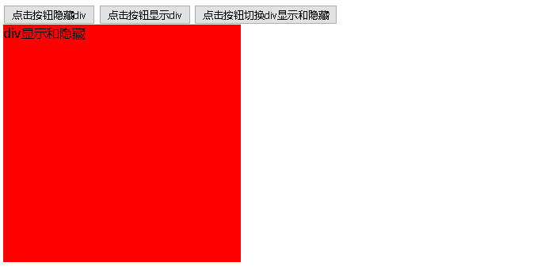

## 5.2 滑动效果

* **方法**

| 方法名称                           | 解释                                    |
| ---------------------------------- | --------------------------------------- |
| slideDown([speed,[easing],[fn]])   | 向下滑动方法                            |
| slideUp([speed,[easing],[fn]])     | 向上滑动方法                            |
| slideToggle([speed],[easing],[fn]) | 切换元素方法，向下使之向下,向下使之向上 |

* **参数**

| 参数名称 | 解释                                                         |
| -------- | ------------------------------------------------------------ |
| speed    | 三种预定速度之一的字符串("slow","normal", or "fast")或表示动画时长的毫秒数值(如：1000) |
| easing   | 用来指定切换效果，默认是"swing"，可用参数"linear"            |
| fn       | 在动画完成时执行的函数，每个元素执行一次                     |

* **示例**

```html
<!DOCTYPE html>
<html>
  <head>
    <meta charset="UTF-8">
    <title>Insert title here</title>
    <script type="text/javascript" src="../js/jquery-3.3.1.min.js"></script>
    <script type="text/javascript">
      function hideFn(){
        $("#showDiv").fadeOut("slow","swing");
      }
      function showFn(){
        $("#showDiv").fadeIn("normal","swing");
      }
      function toggleFn(){
        $("#showDiv").fadeToggle(5000,"linear");
      }
    </script>
  </head>
  <body>
    <input type="button" value="点击按钮隐藏div" onclick="hideFn()">
    <input type="button" value="点击按钮显示div" onclick="showFn()">
    <input type="button" value="点击按钮切换div显示和隐藏" onclick="toggleFn()">

    <div id="showDiv" style="width:300px;height:300px;background:red">
      div显示和隐藏
    </div>
  </body>
</html>
```

* **示例效果图**

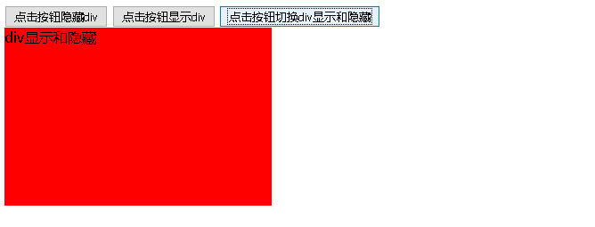

## 5.3 淡入淡出效果

- **方法**

| 方法名称                 | 解释             |
| ------------------------ | ---------------- |
| fadeIn([s],[e],[fn])     | 淡入方法         |
| fadeOut([s],[e],[fn])    | 淡出方法         |
| fadeTo([[s],o,[e],[fn]]) | 设置元素的透明度 |
| fadeToggle([s,[e],[fn]]) | 淡入淡出之间切换 |

- **参数**

| 参数名称 | 解释                                                         |
| -------- | ------------------------------------------------------------ |
| speed    | 三种预定速度之一的字符串("slow","normal", or "fast")或表示动画时长的毫秒数值(如：1000) |
| easing   | 用来指定切换效果，默认是"swing"，可用参数"linear"            |
| fn       | 在动画完成时执行的函数，每个元素执行一次                     |
| opacity  | 一个0至1之间表示透明度的数字                                 |

- **示例**

```html
<!DOCTYPE html>
<html>
<head>
<meta charset="UTF-8">
<title>Insert title here</title>
<script src="https://cdn.bootcss.com/jquery/3.2.1/jquery.js"></script></
<script type="text/javascript">
	function hideFn(){
		$("#showDiv").fadeOut(1000);//1秒钟淡出(隐藏)
	}
	
	function showFn(){
		$("#showDiv").fadeIn(1000);//1秒钟淡入(显示)
	}
	
	function toggleFn(){
		$("#showDiv").fadeToggle(1000);//1秒钟淡入淡出之间切换
	}
	
	function fadeTofn(){
		$("#showDiv").fadeTo(2000,0.5);//2秒钟设置div的透明度为50%
	}
</script>
</head>
<body>
	<input type="button" value="点击按钮隐藏div" onclick="hideFn()">
	<input type="button" value="点击按钮显示div" onclick="showFn()">
	<input type="button" value="点击按钮切换div显示和隐藏" onclick="toggleFn()">
	<input type="button" value="点击按钮设置div透明度" onclick="fadeTofn()">

	<div id="showDiv" style="width:300px;height:300px;background:red">
		div显示和隐藏
	</div>
</body>
</html>
```

# 五.jQuery的遍历

jQuery对象本身就是数组对象，通过jQuery选择器获得的都是满足该选择器条件的元素对象的集合体。因此常常需要对jQuery对象进行遍历。

## 5.1 原始方式遍历

- **语法**

```js
for(var i=0;i<元素数组.length;i++){
  	元素数组[i];
}
```

- **代码**

```html
<!DOCTYPE html>
<html>
	<head>
		<meta charset="UTF-8">
		<title></title>
		<script src="../js/jquery-3.3.1.min.js" type="text/javascript" charset="utf-8"></script>
		<script type="text/javascript">
			$(function(){
				var $lis = $("#city li");
				//1、原始循环方式
				for(var i=0;i<$lis.length;i++){
					console.log($($lis[i]).html());
				}
			});
		</script>
	</head>
	<body>
		<ul id="city">
			<li>北京</li>
			<li>上海</li>
			<li>天津</li>
			<li>重庆</li>
		</ul>
	</body>
</html>

```

- **代码效果**

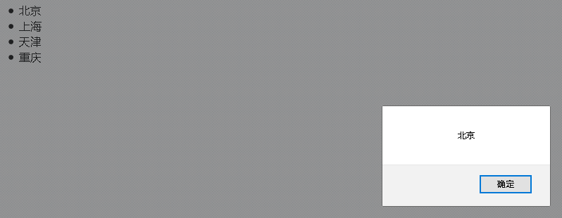

## 5.2 jquery对象方法遍历

- **语法**

```js
jquery对象.each(function(index,element){});

其中，
index:就是元素在集合中的索引
element：就是集合中的每一个元素对象
```

- **代码**

```html
<!DOCTYPE html>
<html>
	<head>
		<meta charset="UTF-8">
		<title></title>
		<script src="../js/jquery-3.3.1.min.js" type="text/javascript" charset="utf-8"></script>
		<script type="text/javascript">
			$(function(){
				var $lis = $("#city li");
				$lis.each(function(index,element){
					console.log(index+"--"+$(element).html());
				});
			});
		</script>
	</head>
	<body>
		<ul id="city">
			<li>北京</li>
			<li>上海</li>
			<li>天津</li>
			<li>重庆</li>
		</ul>
	</body>
</html>

```

- **代码效果**

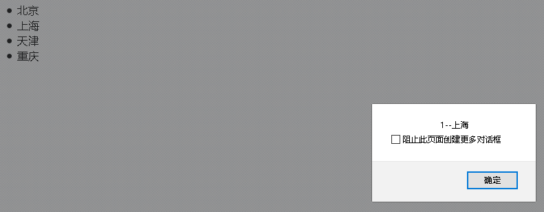

## 5.3 jquery的全局方法遍历

- **语法**

```js
$.each(jquery对象,function(index,element){});

其中，
index:就是元素在集合中的索引
element：就是集合中的每一个元素对象
```

- **代码**

```html
<!DOCTYPE html>
<html>
	<head>
		<meta charset="UTF-8">
		<title></title>
		<script src="../js/jquery-3.3.1.min.js" type="text/javascript" charset="utf-8"></script>
		<script type="text/javascript">
			$(function(){
				var $lis = $("#city li");
				$.each($lis, function(index,element) {
					console.log(index+"--"+$(element).html());
				});
			});
		</script>
	</head>
	<body>
		<ul id="city">
			<li>北京</li>
			<li>上海</li>
			<li>天津</li>
			<li>重庆</li>
		</ul>
	</body>
</html>

```

- **代码效果**

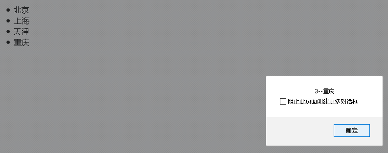

## 5.4 jQuery3.0新特性for  of语句遍历

- **语法**

```js
for(变量 of jquery对象){
  	变量；
}

其中，
变量:定义变量依次接受jquery数组中的每一个元素
jquery对象：要被遍历的jquery对象
```

- **代码**

```html
<!DOCTYPE html>
<html>
  <head>
    <meta charset="UTF-8">
    <title></title>
    <!-- 版本是3以上 -->
    <script src="../js/jquery-3.3.1.min.js" type="text/javascript" charset="utf-8"></script>
    <script type="text/javascript">
      $(function(){
        var $lis = $("#city li");
        for(li of $lis){
          console.log($(li).html());
        }
      });
    </script>
  </head>
  <body>
    <ul id="city">
      <li>北京</li>
      <li>上海</li>
      <li>天津</li>
      <li>重庆</li>
    </ul>
  </body>
</html>


```

- **代码效果**

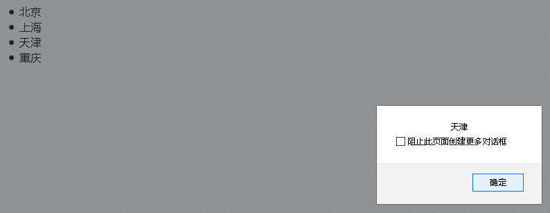


# 六.jQuery的事件

## 常用事件

jQuery绑定事件,事件名字没有on

| 事件名称  | 事件说明                                             |
| --------- | ---------------------------------------------------- |
| blur      | 事件源失去焦点                                       |
| click     | 单击事件源                                           |
| change    | 内容改变                                             |
| keydown   | 接受键盘上的所有键(键盘按下)                         |
| keypress  | 接受键盘上的部分键（ctrl,alt,shift等无效）(键盘按下) |
| keyup     | 键盘抬起                                             |
| mouseover | 鼠标悬停(鼠标移入)                                   |
| mouseout  | 鼠标离开                                             |

## 6.1 on绑定事件

- **语法**

```js
jQuery元素对象.on(事件名称,function(){
  	//逻辑代码
})

其中：事件名称是jQuery的事件方法的方法名称，例如：click、mouseover、mouseout、focus、blur等

```

- **代码**

```html
<!DOCTYPE html>
<html>
	<head>
		<meta charset="UTF-8">
		<title></title>
		<script src="js/jquery-3.3.1.js" type="text/javascript" charset="utf-8"></script>
		<script type="text/javascript">
			$(function(){
				/*$("#btn").on("click",function(){
					alert("按钮被点击了!");
				});*/
				$("#btn").click(function(){
					alert("按钮被点击了!");
				});
			});
		</script>
	</head>
	<body>
		<input id="btn" type="button" value="使用on绑定点击事件">
	</body>
</html>
```

- **代码效果**

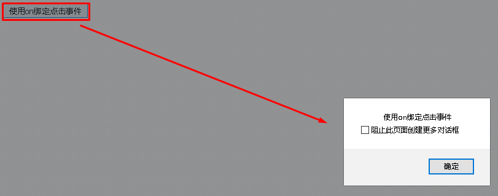

## 6.2 off解绑事件

- **语法**

```js
jQuery元素对象.off(事件名称);

其中：参数事件名称如果省略不写，可以解绑该jQuery对象上的所有事件

```

- **代码**

```html
<!DOCTYPE html>
<html>
	<head>
		<meta charset="UTF-8">
		<title></title>
		<script src="../js/jquery-3.3.1.min.js" type="text/javascript" charset="utf-8"></script>
		<script type="text/javascript">
			$(function(){
				$("#btn-on").on("click",function(){
					alert("使用on绑定点击事件");
				});
				$("#btn-off").click(function(){
					$("#btn-on").off("click");
				});
			});
		</script>
	</head>
	<body>
		<input id="btn-on" type="button" value="使用on绑定点击事件">
		<input id="btn-off" type="button" value="使用off解绑点击事件">
	</body>
</html>

```

- **代码效果**

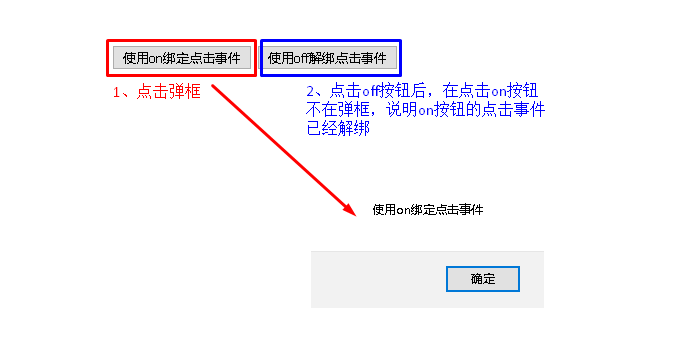

## 6.3 事件切换

### 普通写法

- **代码**

```html
<!DOCTYPE html>
<html>
	<head>
		<meta charset="UTF-8">
		<title></title>
		<script src="../js/jquery-3.3.1.min.js" type="text/javascript" charset="utf-8"></script>
		<script type="text/javascript">
			$(function(){
				$("#myDiv").mouseover(function(){
					$(this).css("background","green");
				});
				$("#myDiv").mouseout(function(){
					$(this).css("background","red");
				});
			});
		</script>
	</head>
	<body>
		<div id="myDiv" style="width:300px;height:300px;background:red">鼠标移入变成绿色，移出回复红色</div>
	</body>
</html>


```

- **效果**

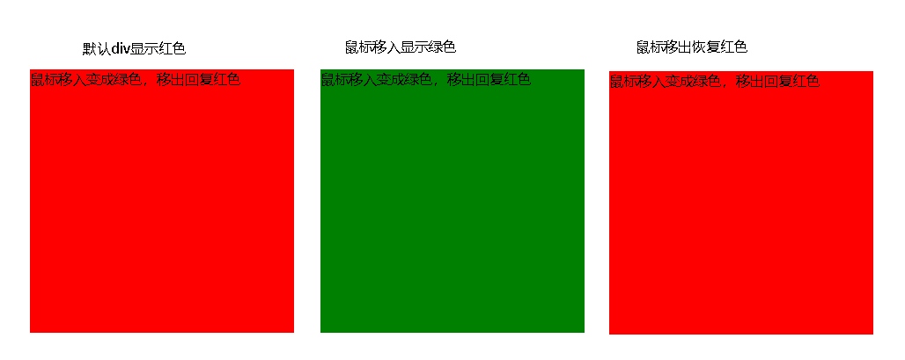

### 链式写法

- **代码**

```html
<!DOCTYPE html>
<html>
	<head>
		<meta charset="UTF-8">
		<title></title>
		<script src="../js/jquery-3.3.1.min.js" type="text/javascript" charset="utf-8"></script>
		<script type="text/javascript">
			$(function(){
				$("#myDiv").mouseover(function(){
					$(this).css("background","green");
				}).mouseout(function(){
					$(this).css("background","red");
				});
			});
		</script>
	</head>
	<body>
		<div id="myDiv" style="width:300px;height:300px;background:red">鼠标移入变成绿色，移出回复红色</div>
	</body>
</html>

```

- **效果**


### 切换函数写法

- **语法**

```http
hover([over,]out)
	其中：
	over代表鼠标移入事件触发的函数；
	out代表鼠标移出事件触发的函数。
```

- **代码**

```html
<!DOCTYPE html>
<html>
	<head>
		<meta charset="UTF-8">
		<title></title>
		<script src="../js/jquery-3.3.1.min.js" type="text/javascript" charset="utf-8"></script>
		<script type="text/javascript">
			$(function(){
				$("#myDiv").hover(function(){
					$(this).css("background","green");
				},function(){
					$(this).css("background","red");
				});
			});
		</script>
	</head>
	<body>
		<div id="myDiv" style="width:300px;height:300px;background:red">鼠标移入变成绿色，移出回复红色</div>
	</body>
</html>

```

- **效果**


# 七.jQuery的插件

## 1.jQuery的插件机制

### jQuery插件机制概述

jQuery插件的机制很简单，就是利用jQuery提供的jQuery.fn.extend()和jQuery.extend()方法，扩展jQuery的功能。

### jQuery插件机制语法 

| 语法                     | 解释                     |
| ------------------------ | ------------------------ |
| jQuery.fn.extend(object) | 对jQuery对象进行方法扩展 |
| jQuery.extend(object)    | 对jQuery全局进行方法扩展 |

### 对jQuery对象进行方法扩展

- 代码

```html
<!DOCTYPE html>
<html>
	<head>
		<meta charset="UTF-8">
		<title></title>
		<script src="jquery-3.3.1.js" type="text/javascript" charset="utf-8"></script>
		<script type="text/javascript">
			//普通方式--点击选中复选框
			function checkFn(){
				$("input[type='checkbox']").prop("checked",true);
			}
			//普通方式--点击取消复选框选中
			function uncheckFn(){
				$("input[type='checkbox']").prop("checked",false);
			}
			
            //对jQuery的函数进行扩展
			jQuery.fn.extend({
				//定义全选函数
				check:function(){
					$(":checkbox").prop("checked",true);
				},
				//定义全不全函数
				uncheck:function(){
					$(":checkbox").prop("checked",false);
				}
			});
			
			//插件方式--点击选中复选框
			function checkFn1(){
				//任何一个jQuery对象都可以调用
				$("#btn1-check").check();
			}
			
			//插件方式--点击选中复选框
			function uncheckFn2(){
				$("#btn-check").uncheck();
			}
		</script>
	</head>
	<body>
		<input id="btn-check" type="button" value="点击选中复选框" onclick="checkFn()">
		<input id="btn-uncheck" type="button" value="点击取消复选框选中" onclick="uncheckFn()">
		<br/>
		<input type="checkbox" value="football">足球
		<input type="checkbox" value="basketball">篮球
		<input type="checkbox" value="volleyball">排球
	
	</body>
</html>

```

- 效果


### 对jQuery全局进行方法扩展

- 代码

```html
<!DOCTYPE html>
<html>
	<head>
		<meta charset="UTF-8">
		<title></title>
		<script src="jquery-3.3.1.js" type="text/javascript" charset="utf-8"></script>
		<script type="text/javascript">
			$.extend({
				  //定义js对象的min属性，值是一个函数，返回a与b比较的最小值
				  min: function(a, b) { return a < b ? a : b; },
				  //定义js对象的max属性，值是一个函数，返回a与b比较的最大值
				  max: function(a, b) { return a > b ? a : b; }
			});
			
			alert($.max(3,5));
		</script>
	</head>
	<body>
		
	</body>
</html>
```

- 效果

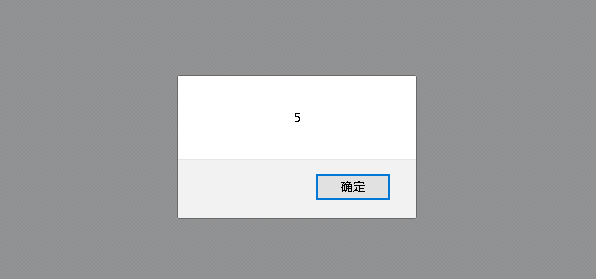


## 2.表单校验插件validator

### 表单校验插件概述

网络上有许多成熟的插件共使用者参考，插件就是将jquery实现的常用操作进行封装，封装后的“小框架“就可以叫做插件，按照插件的语法去操作可以实现很多复杂的功能，而我们需要做的是学会该插件的使用语法即可。表单校验插件是按照一定的语法编写代码，可以使用简单的代码完成复杂的表单校验工作。

### 表单校验插件的基本语法

#### 开发步骤

- 下载jquery-validation插件

- 将该插件（也就是一个js文件）导入到我们的工程中

- 在要使用校验插件的html中引入该js文件

- 编写表单校验的代码（语法）

  ```js
  $("form表单的选择器").validate({
      rules:{
        表单项name值:校验规则，
        表单项name值:校验规则... ...
      },
      messages:{
        表单项name值:错误提示信息，
        表单项name值:错误提示信息... ...
      }
  });
  ```

  其中，rules是对表单项校验的规则，messages是对应的表单项校验失败后的错误提示信息

  注意，当错误提示信息不按照我们预想的位置显示时，我们可以按照如下方式进行设置自定义错误显示标签放在我们需要显示的位置，当此表单项验证不通过时会将此信息自动显示出来，jQuery验证插件会自动帮助我们控制它的显示与隐藏

  ```html
  <lable for="html元素name值" class="error" style="display:none">错误信息</lable>
  ```

  如果设置了错误lable标签就不必在messages中设置此表单项错误提示信息了

#### 常用的校验规则

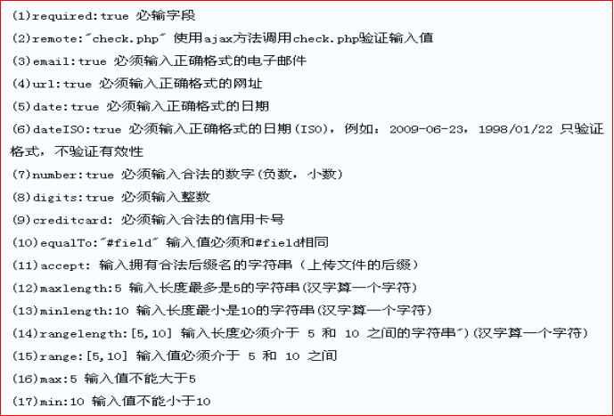

```javascript
校验类型	取值	描述
required	true|false	必填字段
email	true	邮件地址
url		路径
date	true	校验日期的有效性
dateISO	true	校验日期格式（YYYY-MM-dd）
number		数字（负数，小数）
digits	true	整数
minlength	数字	最小长度
maxlength	数字	最大长度
rangelength	[minL,maxL]	长度范围
min		最小值
max		最大值
range	[min,max]	值范围
equalTo:"#id"	jQuery表达式	两个值相同
remote	url路径	ajax校验
```

### 表单校验插件自定义校验方法

如果预定义的校验规则尚不能满足需求的话可以进行自定义校验规则：

自定义校验规则步骤如下：

- 使用$.validator.addMethod("校验规则名称",function(value,element,params){});
- 在rules中通过校验规则名称使用校验规则
- 在messages中定义该规则对应的错误提示信息其中
  - value是校验组件的value值
  - element是校验组件的节点对象
  - params是校验规则的参数

### 代码实现

```html
<html>
    <head>
        <meta http-equiv="Content-Type" content="text/html; charset=utf-8" />
        <title>我的jquery表单校验页面</title>
        
		<style type="text/css">
			p{text-align: center;font-size:24px;}
			table{margin: 0 auto;border: 0;}
			table tr{height:40px;border:0;}
			table tr td{padding:0 14px;border:1px solid #999}
			.error{color:red}
		</style>
		
        <script type="text/javascript" src="jquery-3.3.1.js"></script>
        <script type="text/javascript" src="jquery.validate.js"></script>
       	<script type="text/javascript">
       		
       		$(function(){
       			//自定义校验规则
       			/*
       			 * 参数：
       			 * 	第一个 规则名称
       			 * 	第二个 规则的实现逻辑 匿名函数
       			 */
       			$.validator.addMethod("cardlength",function(value,element,param){
       				//校验输入的长度是否满足15或18
       				if(value.trim().length!=param[0]&&value.trim().length!=param[1]){
       					return false; //代表该校验器不通过  显示该校验规则对应的错误信息
       				}
       				return true;
       			});
       			
       			
       			$.validator.addMethod("card15",function(value,element,param){
       				//校验15位的规则是否正确  --- 都是数字
       				var regExp15 = /^[0-9]{15}$/;
       				if(value.trim().length==15){
       					//校验格式
       					return regExp15.test(value.trim());
       				}
       				return true;//放行 不归该校验器校验 
       			});
       			
       			$.validator.addMethod("card18",function(value,element,param){
       				if(param){
       					//校验15位的规则是否正确  --- 都是数字
	       				var regExp18 = /^[0-9]{18}|[0-9]{17}X$/;
	       				if(value.trim().length==18){
	       					//校验格式
	       					return regExp18.test(value.trim());
	       				}
       				}
       				return true;//放行 不归该校验器校验 
       			});
       			
       			$("#empForm").validate({
	       			rules:{
	       				realname:"required",
	       				username:{
	       					required:true,
	       					rangelength:[5,8]
	       				},
	       				psw:{
	       					required:true,
	       					minlength:6,
	       					maxlength:12
	       				},
	       				psw2:{
	       					required:true,
	       					minlength:6,
	       					maxlength:12,
	       					equalTo:"#psw"
	       				},
	       				gender:{
	       					required:true
	       				},
	       				age:{
	       					required:true,
	       					range:[26,50]
	       				},
	       				edu:{
	       					required:true
	       				},
	       				birthday:{
	       					required:true,
	       					dateISO:true,
	       					date:true
	       				},
	       				checkbox1:{
	       					required:true
	       				},
	       				email:{
	       					email:true
	       				},
	       				card:{
	       					required:true,
	       					cardlength:[15,18],
	       					card15:true,
	       					card18:true
	       				}
	       			},
	       			messages:{
	       				realname:"真实姓名必须写",
	       				username:{
	       					required:"用户名必须写",
	       					rangelength:"长度在5-8之间"
	       				},
	       				psw:{
	       					required:"密码必须写",
	       					minlength:"最小是6位",
	       					maxlength:"最大是12位"
	       				},
	       				psw2:{
	       					required:"密码必须写",
	       					minlength:"最小是6位",
	       					maxlength:"最大是12位",
	       					equalTo:"密码输入不一致"
	       				},
	       				age:{
	       					required:"年龄必须写",
	       					range:"年龄必须在26-50之间"
	       				},
	       				edu:{
	       					required:"必须选择一个"
	       				},
	       				birthday:{
	       					required:"生日必须填写",
	       					dateISO:"日期格式不正确",
	       					date:"日期非法"
	       				},
	       				email:{
	       					email:"邮箱格式不正确"
	       				},
	       				card:{
	       					required:"身份证必须填写",
	       					cardlength:"身份证长度是15或18位",
	       					card15:"15位的身份证必须都是数字",
	       					card18:"18位的身份证必须都是数字或末尾是X"
	       				}
	       			}
	       		});
       		});
       		
       		
       		
       	</script>

</head>
<body>
    <p>员工信息录入</p>
	<form name="empForm" id="empForm" method="post" action="test.html">
		<table border=1>
			<tr>
				<td>真实姓名(不能为空 ,没有其他要求)</td>
				<td><input type="text" id="realname" name="realname" />
				</td>
			</tr>
			<tr>
				<td>登录名(登录名不能为空,长度应该在5-8之间,可以包含中文字符(一个汉字算一个字符)):</td>
				<td><input type="text" id="username" name="username" /></td>
			</tr>
			 <tr> 
		      <td>密码(不能为空,长度6-12字符或数字,不能包含中文字符):</td>
		      <td><input type="password" id="psw"  name="psw" /></td>
		    </tr>
		    <tr> 
		      <td>重复密码密码(不能为空,长度6-12字符或数字,不能包含中文字符):</td>
		      <td><input type="password" id="psw2" name="psw2" /></td>
		    </tr>
		    <tr>
				<td>性别(必选其一)</td>
				<td>
				    <input  type="radio" id="gender_male" value="m" name="gender"/>&nbsp;男
				    <input  type="radio" id="gender_female" value="f" name="gender"/>&nbsp;女
				    <label class="error" for="gender" style="display: none;">必须选择一个性别						</label>
				</td>
			</tr>
			<tr>
				<td>年龄(必填26-50):</td>
				<td><input type="text" id="age" name="age" /></td>
          	</tr>
		    <tr> 
		      <td>你的学历:</td>
		      <td> <select name="edu" id="edu">
			          <option value="">－请选择你的学历－</option>
			          <option value="a">专科</option>
			          <option value="b">本科</option>
			          <option value="c">研究生</option>
			          <option value="e">硕士</option>
			          <option value="d">博士</option>
		          </select>
			  </td>
		    </tr>
			<tr> 
              <td>出生日期(1982/09/21):</td>
               <td><input type="text" id="birthday"  name="birthday" value="" /></td>
            </tr>
		   	<tr> 
		      <td>兴趣爱好:</td>
		      <td colspan="2"> 
			      <input type="checkbox" name="checkbox1" id="qq1"/>&nbsp;乒乓球 &nbsp;
		          <input type="checkbox" name="checkbox1" id="qq2" value="1" />&nbsp;羽毛球 
		          <input type="checkbox" name="checkbox1" id="qq3" value="2" />&nbsp;上网
		          <input type="checkbox" name="checkbox1" id="qq4" value="3" />&nbsp;旅游
		          <input type="checkbox" name="checkbox1" id="qq5" value="4" />&nbsp;购物
		          <label class="error" for="checkbox1" style="display: none;">必须选一个</label>
			  </td>
		    </tr>
			<tr> 
			      <td align="left">电子邮箱:</td>
			      <td><input type="text" id="email" name="email" /></td>
			</tr>
			<tr> 
			      <td align="left">身份证(15-18):</td>
			      <td><input type="text" id="card" name="card" /></td>
			</tr>
			<tr>
				<td></td>
				<td><input type="submit"  name="firstname"  id="firstname" value="保存"></td>
			</tr>
		</table>
</form>
</body>
</html>
```

### 代码效果


# 八.ajax概述

## 1.什么是ajax

Ajax 即"Asynchronous Javascript And XML"（异步 JavaScript 和 XML），是指一种创建交互式网页应用的网页开发技术。Ajax = 异步 JavaScript 和 XML（标准通用标记语言的子集）。通过在后台与服务器进行少量数据交换，Ajax 可以使网页实现**异步**更新。这意味着可以在不重新加载整个网页的情况下，对网页的某部分进行更新。传统的网页（不使用 Ajax）如果需要更新内容，必须重载整个网页页面。

## 2.AJAX的应用场景

ajax的应用场景很多，常见的应用场景如下：

### 检查用户名是否已经被注册

很多站点的注册页面都具备自动检测用户名是否存在的友好提示，该功能整体页面并没有刷新，但仍然可以异步与服务器端进行数据交换，查询用户的输入的用户名是否在数据库中已经存在。

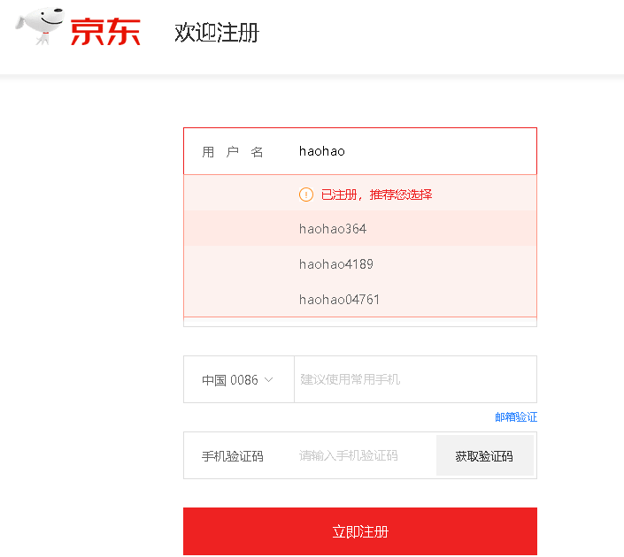

### 省市二联下拉框联动

很多站点都存在输入用户地址的操作，在完成地址输入时，用户所在的省份是下拉框，当选择不同的省份时会出现不同的市区的选择，这就是最常见的省市联动效果。

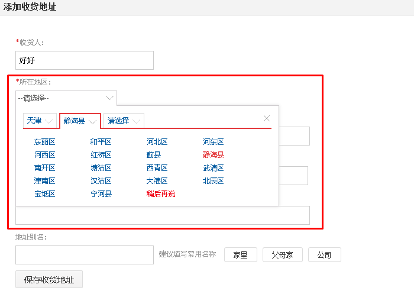

### 内容自动补全

不管是专注于搜索的百度，还是站点内商品搜索的京东，都有搜索功能，在i搜索框输入查询关键字时，整个页面没有刷新，但会根据关键字显示相关查询字条，这个过程是异步的。

**百度的搜索补全功能：**

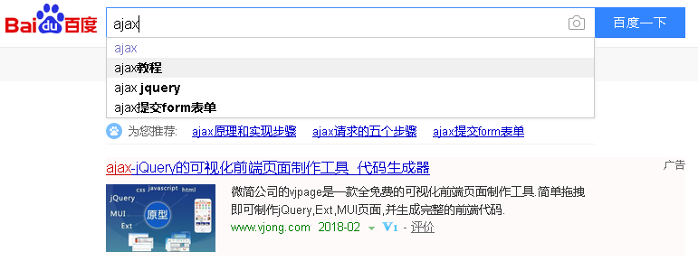


**京东的搜索补全功能：**

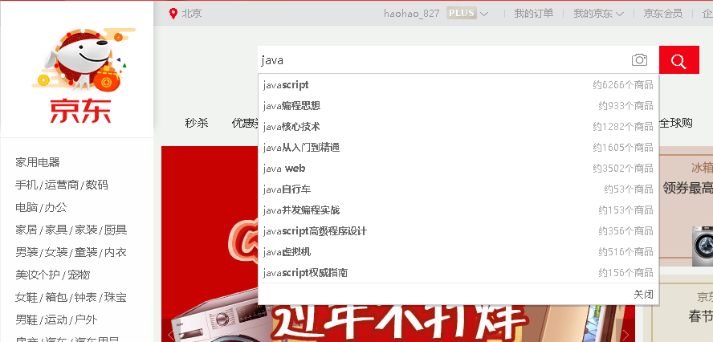


## 3.同步方式与异步方式的区别

### 同步方式发送请求

发送一个请求，需要等待响应返回，然后才能够发送下一个请求，如果该请求没有响应，不能发送下一个请求，客户端会处于一直等待过程中。(卡死)

### 异步方式发送请求

发送一个请求，不需要等待响应返回，随时可以再发送下一个请求，即不需要等待。

# 九.js原生的ajax

## 1.js原生的ajax的开发步骤

1）创建Ajax引擎对象

2）为Ajax引擎对象绑定监听服务器变化的事件

​	设置回调函数(自定义函数,服务器响应成功后,AJAX自动调用函数)

3）绑定提交地址

4）发送请求

5）接受响应数据

## 2.js原生的ajax的代码实现

- js代码

```html
<%@ page contentType="text/html;charset=UTF-8" language="java" %>
<html>
<head>
    <title>Title</title>
    <script type="text/javascript">
        function butOnclick() {
            //1.获取AJAX对象
            var xmlhttp = new XMLHttpRequest();
            //2.给AJAX对象添加监听AJAX引擎状态变化的事件,并设置事件的回调函数
            xmlhttp.onreadystatechange=function()
            {         
                if (xmlhttp.readyState==4 && xmlhttp.status==200)
                {
                    // 5.获取服务器响应的数据
                    document.getElementById("myDiv").innerHTML=xmlhttp.responseText;
                }
            }

            //3.绑定要发送到服务器的地址
            xmlhttp.open("GET","${pageContext.request.contextPath}/js_ajax",true);

            //4.把AJAX请求发送到服务器
            xmlhttp.send();
        }
    </script>
</head>
<body>
    <input type="button" value="AJAX异步提交" onclick="butOnclick()"/>
    <div id="myDiv"></div>
</body>
</html>
```

- Servlet代码

```java
@WebServlet(urlPatterns = "/js_ajax")
public class Demo01JS_AJAXServlet extends HttpServlet {
    protected void doGet(HttpServletRequest request, HttpServletResponse response) throws ServletException, IOException {
        //给客户端响应数据
        response.setContentType("text/htm;charset=UTF-8");
        response.getWriter().write("服务器接收到了AJAX的异步请求!");
    }

    protected void doPost(HttpServletRequest request, HttpServletResponse response) throws ServletException, IOException {
        doGet(request, response);
    }
}
```

- 代码实现效果

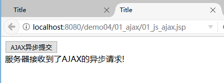


# 十.jQuery框架的ajax

## 1.jQuery框架的ajax简介

jquery是一个优秀的js框架，自然对js原生的ajax进行了封装，封装后的ajax的操	作方法更简洁，功能更强大，与ajax操作相关的jquery方法有如下几种，但开发中	经常使用的有三种：

| 请求方式 | 语法                                          |
| -------- | --------------------------------------------- |
| GET请求  | $.get(url, *[data]*, *[callback]*, *[type]*)  |
| POST请求 | $.post(url, *[data]*, *[callback]*, *[type]*) |
| AJAX请求 | $.ajax([settings])                            |

## 2.GET请求方式

#### 概述

通过远程 HTTP GET 请求载入信息。这是一个简单的 GET 请求功能，如需复杂的ajax参数设置请使用$.ajax。

#### 语法

jQuery.get(url, [data], [callback], [type])

其中，参数说明如下：

| 参数名称 | 解释                                                         |
| -------- | ------------------------------------------------------------ |
| url      | 请求的服务器端url地址                                        |
| data     | 发送给服务器端的请求参数，格式可以是key=value                |
| callback | 回调函数,服务器响应成功后,AJAX自动调用函数                   |
| type     | 预期的返回数据的类型，取值可以是 xml, html, script, json, text, _defaul等 |

#### 代码

- js代码

```html
<html>
<head>
<meta http-equiv="Content-Type" content="text/html; charset=UTF-8">
<title>Insert title here</title>
<script type="text/javascript" src="jquery-3.3.1.js"></script>
<script type="text/javascript">
	function sendRequest(){
		$.get(
			"/AjaxDemo/ajaxServlet",
			"name=haohao&age=33",
			function(data){
				alert(data);
			},
			"text"
		);
	}
</script>
</head>
<body>
	<input type="button" value="ajax异步访问服务器端" onclick="sendRequest()">
</body>
</html>

```

- Servlet代码

```java
package com.itheima.servlet;

@WebServlet("/ajaxServlet")
public class AjaxServlet extends HttpServlet {
	
	protected void doGet(HttpServletRequest request, HttpServletResponse response) throws ServletException, IOException {
		//获得请求参数
		String name = request.getParameter("name");
		String age = request.getParameter("age");
		response.getWriter().write("ajax response data ..."+ name +"..."+age);
	}
	
	protected void doPost(HttpServletRequest request, HttpServletResponse response) throws ServletException, IOException {
		doGet(request, response);
	}

}


```

#### 效果

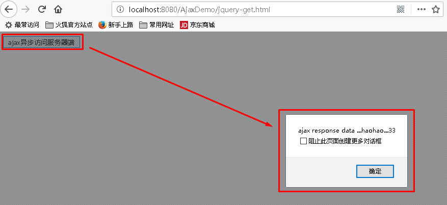

## 3.POST请求方式

#### 概述

通过远程 HTTP POST 请求载入信息。这是一个简单的 POST 请求功能，如需复杂的ajax参数设置请使用$.ajax。

#### 语法

jQuery.post(url, [data], [callback], [type])

其中，参数说明如下：

| 参数名称 | 解释                                                         |
| -------- | ------------------------------------------------------------ |
| url      | 请求的服务器端url地址                                        |
| data     | 发送给服务器端的请求参数，格式可以是key=value                |
| callback | 回调函数,服务器响应成功后,AJAX自动调用函数                   |
| type     | 预期的返回数据的类型，取值可以是 xml, html, script, json, text, _defaul等 |

#### 代码

- 代码

```html
<html>
<head>
<meta http-equiv="Content-Type" content="text/html; charset=UTF-8">
<title>Insert title here</title>
<script type="text/javascript" src="jquery-3.3.1.js"></script>
<script type="text/javascript">
	function sendRequest(){
		$.post(
			"/AjaxDemo/ajaxServlet",
			"name=haohao&age=33",
			function(data){
				alert(data);
			},
			"text"
		);
	}
</script>
</head>
<body>
	<input type="button" value="ajax异步访问服务器端" onclick="sendRequest()">
</body>
</html>

```

- Servlet代码

```java
package com.itheima.servlet;

@WebServlet("/ajaxServlet")
public class AjaxServlet extends HttpServlet {
	
	protected void doGet(HttpServletRequest request, HttpServletResponse response) throws ServletException, IOException {
		//获得请求参数
		String name = request.getParameter("name");
		String age = request.getParameter("age");
		response.getWriter().write("ajax response data ..."+ name +"..."+age);
	}
	
	protected void doPost(HttpServletRequest request, HttpServletResponse response) throws ServletException, IOException {
		doGet(request, response);
	}

}


```

#### 效果


## 4.AJAX请求方式

#### 概述

通过 HTTP 请求加载远程数据。jQuery 底层 AJAX 实现。简单易用的高层实现见get和post方法。$.ajax()方法可以更加详细的设置底层的参数。

#### 语法

jQuery.ajax([settings])

其中，settings是一个js字面量形式的对象，格式是{name:value,name:value... ...}，常用的name属性名如下：

| 属性名称 | 解释                                                         |
| -------- | ------------------------------------------------------------ |
| url      | 请求的服务器端url地址                                        |
| async    | (默认: true) 默认设置下，所有请求均为异步请求。如果需要发送同步请求，请将此选项设置为 false |
| data     | 发送到服务器的数据，可以是键值对形式 k=v&k=v                 |
| type     | (默认: "GET") 请求方式 ("POST" 或 "GET")， 默认为 "GET"      |
| dataType | 预期服务器的返回数据的类型，取值可以是 xml, html, script, **json, text**, _defaul等 |
| success  | 请求成功后的回调函数                                         |
| error    | 请求失败时调用此函数                                         |

#### 代码

- js代码

```html
<html>
<head>
<meta http-equiv="Content-Type" content="text/html; charset=UTF-8">
<title>Insert title here</title>
<script type="text/javascript" src="jquery-3.3.1.js"></script>
<script type="text/javascript">
	function sendRequest(){
		$.ajax({
			url:"/AjaxDemo/ajaxServlet",
			async:true,
			data:"name=haohao&age=33",
			type:"GET",
			dataType:"text",
			success:function(data){
				alert(data);
			},
			error:function(){
				alert("数据没有成功返回!")
			}
		});
	}
</script>
</head>
<body>
	<input type="button" value="ajax异步访问服务器端" onclick="sendRequest()">
</body>
</html>

```

- Servlet代码

```java
package com.itheima.servlet;

@WebServlet("/ajaxServlet")
public class AjaxServlet extends HttpServlet {
	
	protected void doGet(HttpServletRequest request, HttpServletResponse response) throws ServletException, IOException {
		//获得请求参数
		String name = request.getParameter("name");
		String age = request.getParameter("age");
		response.getWriter().write("ajax response data ..."+ name +"..."+age);
	}
	
	protected void doPost(HttpServletRequest request, HttpServletResponse response) throws ServletException, IOException {
		doGet(request, response);
	}

}


```

#### 效果


# 十一.综合案例

## 1.综合案例 ：检测用户名是否已经被注册

### 需求

在用户注册页面，输入用户名，当用户名输入框失去焦点时，发送异步请求，将输入框的用户名传递给服务器端进行是否存在的校验。

### 效果


### 代码实现

#### jsp代码

```html
<%@ page contentType="text/html;charset=UTF-8" language="java" %>
<html>
<head></head>
<meta name="viewport" content="width=device-width, initial-scale=1">
<title>会员注册</title>
<script src="jquery-3.3.1.js" type="text/javascript"></script>

<script type="text/javascript">
	
	function checkUsername(obj){
		//获得该输入框的值
		var username = $(obj).val();
		//将username异步传递给服务器端进行校验 
		$.post(
			"${pageContext.request.contextPath}/user",		
			{"username":username},
			function(data){
				//判断data是true还是false字符串
				if(data.isExist){
					//输入的该用户名已经存在 给提示
					$("#usernameInfo").html("输入的该用户名已经存在").css("color","red");
				}else{
					$("#usernameInfo").html("该用户名可以使用").css("color","green");
				}
			},
			"json"
		);
	}
	
</script>


</head>
<body>
	<div>
		<font>会员注册</font>USER REGISTER
		<form class="form-horizontal" style="margin-top: 5px;">
			用户名<input type="text" name="username" onblur="checkUsername(this)" placeholder="请输入用户名">
			<span id="usernameInfo" style="color:red"></span><br/>
			密码<input type="password" placeholder="请输入密码"><br/>
			<input type="submit" value="注册"/>
		</form>
	</div>
</body>
</html>


```

#### Servlet代码

```java
package com.itheima.servlet;

@WebServlet("/user")
public class UserServlet extends HttpServlet {

	public void doGet(HttpServletRequest request, HttpServletResponse response) throws ServletException, IOException {
		//定义isExist true代表存在  false代表不存在
		boolean isExist = true;
		//获得输入的用户名
		String username = request.getParameter("username");
		if(!"haohao".equals(username)){
			isExist = false;
		}
		//回写存在状态
		String json = "{\"isExist\":"+isExist+"}";
		response.getWriter().write(json);
	}

	public void doPost(HttpServletRequest request, HttpServletResponse response) throws ServletException, IOException {
		doGet(request, response);
	}

}

```

## 2.综合案例 ：内容自动补全

### 需求

在输入框输入关键字，下拉框中异步显示与该关键字相关的商品的名称

### 效果


### 代码实现

#### 导入数据库脚本

导入素材文件夹中的demo.sql


#### 编写实体模型

```java
package com.itheima.autocomplate;

public class User {

	private int id;
	private String name;
	private String password;
	
	public int getId() {
		return id;
	}
	public void setId(int id) {
		this.id = id;
	}
	public String getName() {
		return name;
	}
	public void setName(String name) {
		this.name = name;
	}
	public String getPassword() {
		return password;
	}
	public void setPassword(String password) {
		this.password = password;
	}
	
}


```

#### 编写jsp页面

```html
<%@ page contentType="text/html;charset=UTF-8" language="java" %>
<html>
<head>
<meta http-equiv="Content-Type" content="text/html; charset=UTF-8">
<title>Insert title here</title>
<style type="text/css">
	.content{
		width:643px;
		margin:200px auto;
		text-align: center;
	}
	input[type='text']{
		width:530px;
		height:40px;
		font-size: 14px;
	}
	input[type='button']{
		width:100px;
		height:46px;
		background: #38f;
		border: 0;
		color: #fff;
		font-size: 15px
	}
	.show{
		position: absolute;
		width: 535px;
		border: 1px solid #999;
		border-top: 0;
		display: none;
	}
</style>
<script type="text/javascript" src="jquery-3.3.1.js"></script>
<script type="text/javascript">
	function searchWord(obj){
		//获得当前关键字
		var word = $(obj).val();
		//发送ajax请求
		$.post(
			"${pageContext.request.contextPath}/search",
			"word="+word,
			function(data){
				if(data){
					var content = "";
					for(var i=0;i<data.length;i++){
						content+="<div>"+data[i].name+"</div>";
					}
					$("#show").html(content).show();
				}
			},
			"json"
		);
	}
</script>
</head>
<body>
	<div class="content">
		<br/><br/>
		<input type="text" name="word" onkeyup="searchWord(this)">
		<input type="button" value="搜索一下">
		<div class="show" id="show"></div>
	</div>
</body>
</html>

```

#### 编写Servlet

```java
@WebServlet("/search")
public class SearchServlet extends HttpServlet {
	
	protected void doGet(HttpServletRequest request, HttpServletResponse response) throws ServletException, IOException {
		//设置中文乱码
		request.setCharacterEncoding("UTF-8");
		//获得关键字
		String word = request.getParameter("word");
		//传递关键字到Service
		SearchService searchService = new SearchService();
		List<User> userList = searchService.search(word);
		//转换成json格式的字符串
		ObjectMapper om = new ObjectMapper();
		String json = om.writeValueAsString(userList);
		//设置response中文乱码
		response.setContentType("text/html;charset=UTF-8");
		response.getWriter().write(json);
	}

	protected void doPost(HttpServletRequest request, HttpServletResponse response) throws ServletException, IOException {
		doGet(request, response);
	}

}


```

#### 编写Service

```java
public class SearchService {

	public List<User> search(String word) {
		//调用dao层
		SearchDao searchDao = new SearchDao();
		List<User> userList = null;
		try {
			userList = searchDao.findUserByLikeName(word);
		} catch (SQLException e) {
			e.printStackTrace();
		}
		return userList;
	}
}

```

#### 编写Dao

```java
public class SearchDao {

	public List<User> findUserByLikeName(String word) throws SQLException {
		
        QueryRunner queryRunner = new QueryRunner(JDBCUtils.getDataSource());
		String sql = "select * from user where name like ? limit 0,6";
		//执行查询操作
		List<User> list = queryRunner.query(sql, new BeanListHandler<User>(User.class),"%"+word+"%");
        
		return list;
	}

}


```

#### JdbcUtils工具类

```java
public class JDBCUtils {
	// 创建一个连接池：但是这个连接池只需要创建一次即可。
	private static final ComboPooledDataSource dataSource = new ComboPooledDataSource();
	
	/**
	 * 获得连接的方法
	 */
	public static Connection getConnection() throws SQLException{
		return dataSource.getConnection();
	}
	
	/**
	 * 获得连接池:
	 */
	public static DataSource getDataSource(){
		return dataSource;
	}
	
}


```

#### 配置文件

```properties
<?xml version="1.0" encoding="UTF-8"?>
<c3p0-config>
	<default-config>
		<property name="driverClass">com.mysql.jdbc.Driver</property>
		<property name="jdbcUrl">jdbc:mysql:///web07</property>
		<property name="user">root</property>
		<property name="password">root</property>
		
		<property name="initialPoolSize">5</property>
		<property name="minPoolSize">5</property>
		<property name="maxPoolSize">20</property>
	</default-config> 
</c3p0-config>

```

# 十二.AJAX跨域问题

## 1.1 跨域介绍

### 什么是跨域？

跨域它是不同的**域**名(服务器)之间的相互的资源的访问，因为受到浏览器的**同源策略**保护不能正常访问。


### 什么是同源策略？  

同源策略/SOP（Same origin policy）是一种约定，由Netscape公司1995年引入浏览器，它是浏览器最核心也最基本的安全功能，如果缺少了同源策略，浏览器很容易受到XSS、CSFR等攻击。所谓同源是指"协议+域名+端口"三者相同，即便两个不同的域名指向同一个ip地址，也非同源。 


### 怎么才算跨域

当协议，域名，端口号任意一个不相同，它们就是不同的域。

域名组成:
http://     www .   hello.com  :  8080   /  myproject/abc.html
协议        子域名   主域名            端口号   资源地址
当协议、子域名、主域名、端口号中任意一个不同，都算作跨域。
http://yunpan.baidu.com:8080
https://yunpan.baidu.com:8080


http://abc.baidu.com:8080
http://yunpan.baidu.com:80


http://localhost:8080/day18_8080
http://localhost:8081/day18_8081

### 跨域案例演示

#### 1.创建模块day18_8080

- 导入jQuery

- 创建demo01.html页面

  ```html
  <!DOCTYPE html>
  <html lang="en">
  <head>
      <meta charset="UTF-8">
      <title>ajax跨域请求</title>
      <script src="js/jquery-3.3.1.js"></script>
  
      <script>
          function butOnclick() {
              //发送ajax
              $.ajax({
                  url:"http://localhost:8081/day18_8081/demo01",
                  async:true,
                  data:"name=tom",
                  type:"post",
                  dataType:"json",
                  success:function (data) {
                      alert(data);
                  },
                  error:function () {
                      alert("失败")
                  }
              });
          }
      </script>
  </head>
  <body>
      <input type="button" value="发送ajax请求" onclick="butOnclick()">
  </body>
  </html>
  ```

#### 2.创建模块day18_8181

- 导入转换json数据jar包

- 创建Person对象

  ```java
  package com.itheima.web;
  
  public class Person {
      private String name;
      private int age;
  	
      //getset方法,toString方法
  }
  ```

- 创建Demo01Servlet

  ```java
  package com.itheima.web;
  
  import com.fasterxml.jackson.databind.ObjectMapper;
  import com.sun.xml.internal.fastinfoset.util.ValueArray;
  
  import javax.servlet.ServletException;
  import javax.servlet.annotation.WebServlet;
  import javax.servlet.http.HttpServlet;
  import javax.servlet.http.HttpServletRequest;
  import javax.servlet.http.HttpServletResponse;
  import java.io.IOException;
  
  @WebServlet(urlPatterns = "/demo01")
  public class Demo01Servlet extends HttpServlet {
      protected void doGet(HttpServletRequest request, HttpServletResponse response) throws ServletException, IOException {
          //1.设置字符集
          request.setCharacterEncoding("utf-8");
          response.setContentType("text/html;charset=utf-8");
          //2.获取ajax的请求参数
          String name = request.getParameter("name");
          System.out.println(name);
          //3.创建Person对象
          Person p = new Person("张三",18);
          //4.把Person对象转换为json数据
          ObjectMapper om = new ObjectMapper();
          String json = om.writeValueAsString(p);
          //5.把json数据响应给客户端浏览器
          response.getWriter().write(json);
      }
  
      protected void doPost(HttpServletRequest request, HttpServletResponse response) throws ServletException, IOException {
          doGet(request, response);
      }
  }
  ```

#### 3.分别部署两个项目

​	把day18_8080部署到端口号为**8080**的tomcat

​	把day18_8081部署到端口号为**8081**的tomcat	

#### 4.总结

​	如果使用项目2中的页面方式项目1的资源,能否访问到?不能!!因为跨域了.(会受到同源策略保护) 

​	跨域请求可以请求到服务器的后台,后台也可以返回数据,但是被浏览器阻拦 


### 跨域的一些问题 

​	问题:是不是所有跨域都会被浏览器阻拦?

​	结论:不是,浏览器拦截的跨域三特点:

​		1) 是浏览器限制

​		2) 跨域(当协议、子域名、主域名、端口号中任意一个不同)

​		3) XHR (XMLHttpRequest)请求

​	在跨域过程中,有些方式是不被浏览器拦截的:

```html
<script src="地址"></script> 

<a href="地址">
```

day18_8080创建demo02.html

```html
<!DOCTYPE html>
<html lang="en">
<head>
    <meta charset="UTF-8">
    <title>Title</title>
</head>
<body>
    <!--
        script标签的src属性访问8081服务器,查看是否有同源策略保护
    -->
    <script src="http://localhost:8081/day18_8081/js/abc.js"></script>
    <!--
        img标签的src属性访问8081服务器,查看是否有同源策略保护
    -->
    
</body>
</html>
```

day18_8081中创建js和添加图片

```javascript
alert("8081的js执行了!")
```

### 为什么要解决跨域

以后我们的开发的项目是前后端分类，前台和后台是独立的，就需要前台调用后台的接口，导致出现问题。


## 1.2 跨域解决方案

### 什么情况下会使用到跨域？

- 一般情况是在自己的内部工程中会出现跨域情况。

### 有三种解决方案:

#### 方式1： 代理方案(了解) 

- 把ajax请求其他服务器上的跨域问题进行转换,变成先请求自己的后台服务,通过后台服务间的调用,避免了ajax访问别的服务产生的跨域问题.

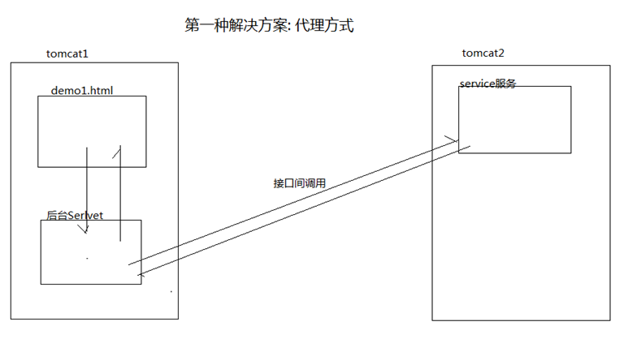

#### 方式2：跨域解决方案CORS官方推荐的

CORS是一个W3C标准，全称是"跨域资源共享"（Cross-origin resource sharing）。CORS需要浏览器和服务器同时支持。目前，所有浏览器都支持该功能，IE浏览器不能低于IE10。

它允许浏览器向跨源服务器，发出XMLHttpRequest请求，从而克服了AJAX只能同源使用的限制。整个CORS通信过程，都是浏览器自动完成，不需要用户参与。对于开发者来说，CORS通信与同源的AJAX通信没有差别，代码完全一样。浏览器一旦发现AJAX请求跨源，就会自动添加一些附加的头信息，有时还会多出一次附加的请求，但用户不会有感觉。因此，实现CORS通信的关键是服务器。只要服务器实现了CORS接口，就可以跨源通信。


浏览器禁止非同源访问，如果在头信息中设置了哪些源可以访问，浏览器检测到则不阻拦，解决同源策略。

后台代码：

```java
//设置可以资源共享的路径是谁(访问-控制-允许-来源)
response.setHeader("Access-Control-Allow-Origin", "http://localhost:8080");
//设置认证信息,作用:携带Cookie
 response.setHeader("Access-Control-Allow-Credentials", "true");
```

前台:

```javascript
// 如果服务器已经让携带cookie,浏览器还是不会携带,必须添加认证信息
// 浏览器再次访问才会携带cookie
xhrFields: {
	withCredentials: true
} 
```

注意：

CORS请求默认不发送Cookie和HTTP认证信息。如果要把Cookie发到服务器，一方面要服务器同意，指定Access-Control-Allow-Credentials字段。另一方面，开发者必须在AJAX请求中打开withCredentials属性。否则，即使服务器同意发送Cookie，浏览器也不会发送。或者，服务器要求设置Cookie，浏览器也不会处理。 

代码实现:

后台day18_8181:Demo02Servlet

```java
package com.itheima.web;

import com.fasterxml.jackson.databind.ObjectMapper;

import javax.servlet.ServletException;
import javax.servlet.annotation.WebServlet;
import javax.servlet.http.HttpServlet;
import javax.servlet.http.HttpServletRequest;
import javax.servlet.http.HttpServletResponse;
import java.io.IOException;

//设置同源的头信息,解决同源策略保护问题
@WebServlet(urlPatterns = "/demo02")
public class Demo02Servlet extends HttpServlet {
    protected void doGet(HttpServletRequest request, HttpServletResponse response) throws ServletException, IOException {
        //1.设置字符集
        request.setCharacterEncoding("utf-8");
        response.setContentType("text/html;charset=utf-8");
        //设置8080和8081为同一个源,共享资源
        //设置可以资源共享的路径是谁(访问-控制-允许-来源)
        response.setHeader("Access-Control-Allow-Origin", "http://localhost:8080");
        //设置认证信息,作用:携带Cookie
        response.setHeader("Access-Control-Allow-Credentials", "true");

        //2.获取ajax的请求参数
        String name = request.getParameter("name");
        System.out.println(name);
        //3.创建Person对象
        Person p = new Person("张三",18);
        //4.把Person对象转换为json数据
        ObjectMapper om = new ObjectMapper();
        String json = om.writeValueAsString(p);
        //5.把json数据响应给客户端浏览器
        response.getWriter().write(json);
    }

    protected void doPost(HttpServletRequest request, HttpServletResponse response) throws ServletException, IOException {
        doGet(request, response);
    }
}
```

前台day18_8180:demo03.html

```html
<!DOCTYPE html>
<html lang="en">
<head>
    <meta charset="UTF-8">
    <title>ajax跨域请求</title>
    <script src="js/jquery-3.3.1.js"></script>

    <script>
        function butOnclick() {
            //发送ajax
            $.ajax({
                url:"http://localhost:8081/day18_8081/demo02",
                async:true,
                data:"name=tom",
                type:"post",
                dataType:"json",
                // 如果服务器已经让携带cookie,浏览器还是不会携带,必须添加认证信息
                // 浏览器再次访问才会携带cookie
                xhrFields: {
                    withCredentials: true
                },
                success:function (data) {
                    alert(data.name);
                },
                error:function () {
                    alert("失败")
                }
            });
        }
    </script>
</head>
<body>
    <input type="button" value="发送ajax请求" onclick="butOnclick()">
</body>
</html>
```

#### 方式3：jsonp

JSONP(JSON with Padding)是[JSON](http://baike.baidu.com/view/136475.htm)的一种“使用模式”,理解为一个包裹着的json，可用于解决主流浏览器的跨域数据访问的问题.

```html
<a>标签，标签以及<script src=”xxxx定义函数callback”>标签中的href属性或src属性获取异域的CSS，JS资源和图片

利用 <script> 元素的这个开放策略，网页可以得到从其他来源动态产生的 JSON 资料，而这种使用模式就是所谓的 JSONP。

总结:jsonp 可以解决浏览器跨域问题; 使用<script>标签来解决 ,因为<script>标签开放了同源保护策略.

```

代码实现:

前台day18_8180:demo04.html

```html
<!DOCTYPE html>
<html lang="en">
<head>
    <meta charset="UTF-8">
    <title>ajax跨域请求</title>
    <script src="js/jquery-3.3.1.js"></script>

    <script>
        function butOnclick() {
            //发送ajax
            $.ajax({
                url:"http://localhost:8081/day18_8081/demo03",
                async:true,
                data:"name=tom",
                type:"post",
                dataType:"jsonp",
                success:function (data) {
                    alert(data.name);
                },
                error:function () {
                    alert("失败")
                }
            });
        }
    </script>
</head>
<body>
    <input type="button" value="发送ajax请求" onclick="butOnclick()">
</body>
</html>
```

后台day18_8181:Demo03Servlet

```java
package com.itheima.web;

import com.fasterxml.jackson.databind.ObjectMapper;

import javax.servlet.ServletException;
import javax.servlet.annotation.WebServlet;
import javax.servlet.http.HttpServlet;
import javax.servlet.http.HttpServletRequest;
import javax.servlet.http.HttpServletResponse;
import java.io.IOException;

//使用jsonp,解决同源策略保护问题
@WebServlet(urlPatterns = "/demo03")
public class Demo03Servlet extends HttpServlet {
    protected void doGet(HttpServletRequest request, HttpServletResponse response) throws ServletException, IOException {
        //1.设置字符集
        request.setCharacterEncoding("utf-8");
        response.setContentType("text/html;charset=utf-8");
        //2.获取ajax的请求参数
        String name = request.getParameter("name");
        //获取到参数callback
        String callback = request.getParameter("callback");
        System.out.println(name);
        //3.创建Person对象
        Person p = new Person("张三",18);
        //4.把Person对象转换为json数据
        ObjectMapper om = new ObjectMapper();
        String json = om.writeValueAsString(p);
        //5.把json数据响应给客户端浏览器
        //对返回的json数据进行包裹
        response.getWriter().write(callback+"("+json+")");
    }

    protected void doPost(HttpServletRequest request, HttpServletResponse response) throws ServletException, IOException {
        doGet(request, response);
    }
}
```

#### 方式3：jsonp简化版本

$.getJson(url ,data, function(data){....})

前台day18_8180:demo05.html

```html
<!DOCTYPE html>
<html lang="en">
<head>
    <meta charset="UTF-8">
    <title>ajax跨域请求</title>
    <script src="js/jquery-3.3.1.js"></script>

    <script>
        function butOnclick() {
            //发送ajax
            $.getJSON("http://localhost:8081/day18_8081/demo04?callback=?","name=tom",function (data) {
                alert(data.name);
            });
        }
    </script>
</head>
<body>
    <input type="button" value="发送ajax请求" onclick="butOnclick()">
</body>
</html>

```

后台day18_8181:Demo04Servlet 和Demo03Servlet一样没有变化


# 十三.AJAX实现增删改查

## 业务需求

使用实现用户信息的增删改查操作

**功能1:全查询**

**功能2:添加**

**功能3:删除**

**功能4:修改(带回显)**

**功能5:批量删除**


## 实现步骤

### 1.数据库搭建

创建两张表 emp员工表,dept部门表

```sql
CREATE DATABASE day18;
USE day18;

#部门表  did  dname
CREATE TABLE dept(
	did INT PRIMARY KEY ,
	dname VARCHAR(30)
);

INSERT INTO dept VALUES(1,'总裁办');
INSERT INTO dept VALUES(2,'研发部');
INSERT INTO dept VALUES(3,'财务部');

#员工表  eid  uname  sex   tel  email  address  did(外键)
CREATE TABLE emp (
	eid INT PRIMARY KEY AUTO_INCREMENT,
	ename VARCHAR(20),
	sex VARCHAR(6),
	tel VARCHAR(20),
	email VARCHAR(50),
	address VARCHAR(200),
	did INT   #外键
);

INSERT INTO emp VALUES(NULL , '刘备','男','13812341234','lb@itheima.com','北京',1);
INSERT INTO emp VALUES(NULL , '诸葛亮','男','010-111111','zg@itheima.com','北京',2);
INSERT INTO emp VALUES(NULL , '关羽','男','13800001111','gy@itheima.com','荆州',2);
INSERT INTO emp VALUES(NULL , '曹操','男','15811112222','cc@itheima.com','许昌',1);
INSERT INTO emp VALUES(NULL , '孙尚香','女','010-1234567','ssx@itheima.com','南京',3);
INSERT INTO emp VALUES(NULL , '小乔','女','010-7654321','xq@itheima.com','南京',1);
INSERT INTO emp VALUES(NULL , '貂蝉','女','13511110000','dc@itheima.com','洛阳',3);


#建立外键关联
ALTER TABLE emp ADD FOREIGN KEY (did)  REFERENCES  dept(did);

#全查询:
SELECT 
eid,ename,sex,tel,email,address,d.dname 
FROM emp e, dept d 
WHERE e.did = d.did
ORDER BY eid;
```

### 2.整体项目搭建


### 3.查询所有数据功能

#### dao

```java
package com.itheima.dao;

import com.itheima.pojo.EmpDept;

import java.sql.SQLException;
import java.util.List;

public interface EmpDao {
    //查询所有数据
    public abstract List<EmpDept> findAll() throws SQLException;
}

```

```java
package com.itheima.dao;

import com.itheima.pojo.EmpDept;
import com.itheima.utils.C3P0UtilsXML;
import org.apache.commons.dbutils.QueryRunner;
import org.apache.commons.dbutils.handlers.BeanListHandler;

import java.sql.SQLException;
import java.util.List;

public class EmpDaoImpl implements EmpDao {
    //查询所有数据
    @Override
    public List<EmpDept> findAll() throws SQLException {
        //创建QueryRunner对象
        QueryRunner qr = new QueryRunner(C3P0UtilsXML.getDataSource());
        //调用query方法执行查询的sql语句
        String sql="SELECT eid,ename,sex,tel,email,address,d.dname FROM emp e, dept d WHERE e.did = d.did ORDER BY eid;";
        List<EmpDept> list = qr.query(sql, new BeanListHandler<>(EmpDept.class));
        return list;
    }
}
```

#### service

```java
package com.itheima.service;

import com.itheima.pojo.EmpDept;

import java.sql.SQLException;
import java.util.List;

public interface EmpService {
    //查询所有数据
    public abstract List<EmpDept> findAll();
}
```

```java
package com.itheima.service;

import com.itheima.dao.EmpDao;
import com.itheima.dao.EmpDaoImpl;
import com.itheima.pojo.EmpDept;

import java.sql.SQLException;
import java.util.List;

public class EmpServiceImpl implements EmpService{
    //查询所有数据
    @Override
    public List<EmpDept> findAll(){
        EmpDao dao = new EmpDaoImpl();
        List<EmpDept> list = null;
        try {
            list = dao.findAll();
        } catch (SQLException e) {
            e.printStackTrace();
        }
        return list;
    }
}

```

#### filter

```java
package com.itheima.web;

import javax.servlet.*;
import javax.servlet.annotation.WebFilter;
import java.io.IOException;

@WebFilter("/*")
public class CharacterFilter implements Filter {
    public void destroy() {
    }

    public void doFilter(ServletRequest req, ServletResponse resp, FilterChain chain) throws ServletException, IOException {
        req.setCharacterEncoding("UTF-8");
        resp.setContentType("text/html;charset=utf-8");
        chain.doFilter(req, resp);
    }

    public void init(FilterConfig config) throws ServletException {

    }
}
```

#### servlet

```java
package com.itheima.web;

import com.fasterxml.jackson.databind.ObjectMapper;
import com.itheima.pojo.EmpDept;
import com.itheima.service.EmpService;
import com.itheima.service.EmpServiceImpl;

import javax.servlet.ServletException;
import javax.servlet.annotation.WebServlet;
import javax.servlet.http.HttpServlet;
import javax.servlet.http.HttpServletRequest;
import javax.servlet.http.HttpServletResponse;
import java.io.IOException;
import java.util.List;

@WebServlet(urlPatterns = "/findAll")
public class FindAllServlet extends HttpServlet {
    protected void doGet(HttpServletRequest request, HttpServletResponse response) throws ServletException, IOException {
        //1.创建EmpService对象
        EmpService service = new EmpServiceImpl();
        //2.调用EmpService对象中的findALl方法,获取查询结果
        List<EmpDept> list = service.findAll();
        //3.把查询结果转换为json数据
        ObjectMapper mapper=new ObjectMapper();
        String json = mapper.writeValueAsString(list);
        //4.把json数据响应回前台
        response.getWriter().print(json);
    }
    protected void doPost(HttpServletRequest request, HttpServletResponse response) throws ServletException, IOException {
        doGet(request,response);
    }
}
```

#### show.html

```html
<html>
  <head>
    <meta charset="utf-8">
    <meta name="viewport" content="width=device-width, initial-scale=1">

    <link href="css/bootstrap.min.css" rel="stylesheet">
    <script src="js/jquery-3.3.1.js"></script>
    <script src="js/bootstrap.min.js"></script>

    <style>
      h1 {
        text-align: center;
      }
      th,td{
        text-align: center;
      }
    </style>
    <script>
        /*
            目标:
                页面加载的时候发送ajax请求,去后台查出来 json [{EmpDept},{}....] ,
                循环json对象 创建tr  td 把数据放到td, 把tr放到table
            实现步骤:
                1.定义一个页面加载事件
                2.创建ajax请求
                3.在回调函数中,循环data数据
                4.在循环中,创建 tr,td,放数据
                5.把创建好的tr添加到table中
         */
         //1.定义一个页面加载事件
        $(function () {
            //2.创建ajax请求
            $.post("/day18_project/findAll",function (data) {
                //3.在回调函数中,循环data数据
                $(data).each(function (index,element) {
                   //alert(element.ename);
                    var $tr = $("<tr>\n" +
                        "          <td><input type='checkbox' value='"+element.eid+"'/></td>\n" +
                        "          <td>"+element.eid+"</td>\n" +
                        "          <td>"+element.ename+"</td>\n" +
                        "          <td>"+element.sex+"</td>\n" +
                        "          <!--<th>照片</th>-->\n" +
                        "          <td>"+element.tel+"</td>\n" +
                        "          <td>"+element.email+"</td>\n" +
                        "          <td>"+element.address+"</td>\n" +
                        "          <td>"+element.dname+"</td>\n" +
                        "          <td><a href='#' class='btn btn-primary'>删除</a>&nbsp;<a href='#' class='btn btn-primary'>修改</a></td>\n" +
                        "        </tr>");
                    //5.把创建好的tr添加到table中
                    $("table").append($tr);
                });
            },"json");
        });
    </script>

  </head>
  <body>
    <div class="container">
      <h1>显示所有员工信息</h1>
      <table class="table table-bordered  table-hover">
        <tr>
          <td colspan="9">
            <a href="add.html" class="btn btn-primary">添加</a>
            <a href="#" class="btn btn-primary">批量删除</a>
          </td>
        </tr>
        <tr class="bg-success">
          <th>选择</th>
          <th>编号</th>
          <th>姓名</th>
          <th>性别</th>
          <!--<th>照片</th>-->
          <th>电话</th>
          <th>邮箱</th>
          <th>地址</th>
          <th>部门</th>
          <th>操作</th>
        </tr>
      </table>
    </div>
  </body>
</html>
```

### 4.删除员工功能

#### dao

```java
public interface EmpDao {
    //根据eid删除Emp对象
    public abstract int delEmpById(int eid) throws SQLException;
}

```

```java
public class EmpDaoImpl implements EmpDao {
    //根据eid删除Emp对象
    @Override
    public int delEmpById(int eid) throws SQLException {
        //创建QueryRunner对象
        QueryRunner qr = new QueryRunner(C3P0UtilsXML.getDataSource());
        int row = qr.update("delete from emp where eid=?", eid);
        return row;
    }
}
```

#### service

```java
public interface EmpService {
    //根据eid删除Emp对象
    public abstract int delEmpById(int eid);
}
```

```java
public class EmpServiceImpl implements EmpService{
    //根据eid删除Emp对象
    @Override
    public int delEmpById(int eid) {
        EmpDao dao = new EmpDaoImpl();
        int row = 0;
        try {
            row = dao.delEmpById(eid);
        } catch (SQLException e) {
            e.printStackTrace();
        }
        return row;
    }
}
```

#### servlet

```java
@WebServlet(urlPatterns = "/delete")
public class DeleteEmpServlet extends HttpServlet {
    protected void doGet(HttpServletRequest request, HttpServletResponse response) throws ServletException, IOException {
        /*
            1.获取用户的请求参数eid
            2.创建EmpSeviceImpl对象
            3.调用根据id删除Emp对象的方法,获取结果
            4.把删除结果响应给客户端浏览器
         */
        //1.获取用户的请求参数eid
        int eid = Integer.parseInt(request.getParameter("eid"));
        //2.创建EmpSeviceImpl对象
        EmpService service = new EmpServiceImpl();
        //3.调用根据id删除Emp对象的方法,获取结果
        int row = service.delEmpById(eid);
        //4.把删除结果响应给客户端浏览器
        response.getWriter().print(row);
    }
}
```

#### show.html

```html
<script>
    <a href='#' class='btn btn-primary' onclick='del(this,"+element.eid+")'>删除</a>

    //定义删除超链接单击事件的响应函数
    function del(aEle,eid) {
        //alert(aEle);
        //alert(eid);
        //获取a标签的父类td,获取td的父类tr,tr自杀
        //$(aEle).parent().parent().remove();//后台删除成功,前台tr在删除
        /*
              分析:
                1.发送ajax请求,获取后台返回的删除结果
                2.对删除的结果进行判断
                  data==1:删除成功,删除tr
                  data!=1:删除失败,给用户提示
           */
        //扩展:添加一个确认框
        var flag = confirm("您确认删除吗?");
        if(!flag){
            return;//用户选择false结束函数
        }

        //1.发送ajax请求,获取后台返回的删除结果
        $.post("/day18_project/delete","eid="+eid,function (data) {
            //alert(data);
            //2.对删除的结果进行判断
            if(data==1){
                //data==1:删除成功,删除tr
                $(aEle).parent().parent().remove();
            }else{
                //data!=1:删除失败,给用户提示
                alert("删除失败!")
            }
        });
    }
</script>
```

### 5.添加员工功能

#### add.html

```html
<html>
<head>
    <meta charset="utf-8">
    <meta http-equiv="X-UA-Compatible" content="IE=edge">
    <meta name="viewport" content="width=device-width, initial-scale=1">

    <link href="css/bootstrap.min.css" rel="stylesheet">
    <script src="js/jquery-3.3.1.js"></script>
    <script src="js/bootstrap.min.js"></script>

</head>
<body>
    <div class="container">
        <center><h1>添加用户</h1></center>
        <form action="/day18_project/add" method="post">
            <div class="form-group">
                <label for="name">用户名</label>
                <input type="text" class="form-control" id="name" name="ename" placeholder="请输入用户名">
            </div>

            <div class="form-group">
                <label>
                    男 <input type="radio"  name="sex"  value="男" checked />
                </label>
                <label>
                    女 <input type="radio"  name="sex" value="女" />
                </label>
            </div>

            <div class="form-group">
                <label for="name">电话</label>
                <input type="text" class="form-control" id="tel" name="tel" placeholder="请输入电话">
            </div>
            <div class="form-group">
                <label for="email">邮箱</label>
                <input type="email" class="form-control" id="email" name="email" placeholder="请输入email">
            </div>
            <div class="form-group">
                <label for="address">地址</label>
                <input type="text" class="form-control" id="address" name="address" placeholder="请输入地址">
            </div>
            <div class="form-group">
                <label>
                    部门
                </label>
                <select name="did" class="form-control" >
                    <option value="1">总裁办</option>
                    <option value="2">研发部</option>
                    <option value="3">财务部</option>
                </select>
            </div>
            <center>
                <button type="submit" id="sub" class="btn btn-primary">提交</button>
                <button type="reset" class="btn btn-default">重置</button>
                <button type="button" class="btn btn-default">返回</button>
            </center>

        </form>
    </div>
</body>
</html>
```

#### dao

```java
public interface EmpDao {
    //添加Emp对象
    public abstract void addEmp(Employee emp) throws SQLException;
}

```

```java
public class EmpDaoImpl implements EmpDao {
    //添加Emp对象
    @Override
    public void addEmp(Employee emp) throws SQLException {
        QueryRunner qr = new QueryRunner(C3P0UtilsXML.getDataSource());
        qr.update("insert into emp values (null,?,?,?,?,?,?)",
                emp.getEname(),emp.getSex(),emp.getTel(),
                  emp.getEmail(),emp.getAddress(),emp.getDid());
    }
}
```

#### service

```java
public interface EmpService {
    //添加Emp对象
    public abstract void addEmp(Employee emp);
}
```

```java
public class EmpServiceImpl implements EmpService{
    //添加Emp对象
    @Override
    public void addEmp(Employee emp) {
        EmpDao dao = new EmpDaoImpl();
        try {
            dao.addEmp(emp);
        } catch (SQLException e) {
            e.printStackTrace();
        }
    }
}
```

#### servlet

```java
package com.itheima.web;

import com.itheima.pojo.Employee;
import com.itheima.service.EmpServiceImpl;
import org.apache.commons.beanutils.BeanUtils;

import javax.servlet.ServletException;
import javax.servlet.annotation.WebServlet;
import javax.servlet.http.HttpServlet;
import javax.servlet.http.HttpServletRequest;
import javax.servlet.http.HttpServletResponse;
import java.io.IOException;
import java.lang.reflect.InvocationTargetException;
import java.util.Map;

@WebServlet(urlPatterns = "/add")
public class AddEmpServlet extends HttpServlet {
    protected void doGet(HttpServletRequest request, HttpServletResponse response) throws ServletException, IOException {
        /*
            1.获取用户在表单中提交的所有数据,返回一个Map集合<String,String[]>
            2.创建Employee对象
            3.使用BeanUtils工具类中的方法populate方法,把map集合中的数据封装到Employee对中
            4.创建EmpServiceImpl对象,调用添加员工的方法
            5.重定向到show.html页面
         */
        //1.获取用户在表单中提交的所有数据,返回一个Map集合<String,String[]>
        Map<String, String[]> map = request.getParameterMap();
        //2.创建Employee对象
        Employee ee = new Employee();
        //3.使用BeanUtils工具类中的方法populate方法,把map集合中的数据封装到Employee对中
        try {
            BeanUtils.populate(ee,map);
        }  catch (Exception e) {
            e.printStackTrace();
        }
        //4.创建EmpServiceImpl对象,调用添加员工的方法
        new EmpServiceImpl().addEmp(ee);
        //5.重定向到show.html页面
        response.sendRedirect(request.getContextPath()+"/show.html");
    }

    protected void doPost(HttpServletRequest request, HttpServletResponse response) throws ServletException, IOException {
        doGet(request, response);
    }
}
```

### 6.修改员工功能

#### 6.1修改回显功能

```javascript
html和html之间传递参数
var url =  document.URL;  //http://localhost:8080/day18_project/update.html?eid=2
```

##### update.html

```html
<html>
<head>
    <meta charset="utf-8">
    <meta http-equiv="X-UA-Compatible" content="IE=edge">
    <meta name="viewport" content="width=device-width, initial-scale=1">

    <link href="css/bootstrap.min.css" rel="stylesheet">
    <script src="js/jquery-3.3.1.js"></script>
    <script src="js/bootstrap.min.js"></script>
    <script>
        /*
            分析:
                1.创建一个页面加载事件
                2.在页面加载事件的响应函数中,获取上一个页面请求的url
                3.对url根据=号进行切割,获取eid
                4.发送ajax请求  $.post("queryEmp","eid="+eid+"",function(data){ },"json");
                5.在ajax的回写函数中给表单中标签设置vlaue值
         */
        //1.创建一个页面加载事件
        $(function () {
            //2.在页面加载事件的响应函数中,获取上一个页面请求的url
            var url = document.URL;
            //alert(url);//http://localhost:8080/day18_project/update.html?eid=2
            //3.对url根据=号进行切割,获取eid
            var eid = url.split("=")[1];
            //alert(eid);
            //4.发送ajax请求  $.post("queryEmp","eid="+eid+"",function(data){ },"json");
            $.post("queryEmp","eid="+eid,function(data){
                //alert(data);
                //5.在ajax的回写函数中给表单中标签设置vlaue值
                $("#eid").val(data.eid);
                $("#ename").val(data.ename);
                $("#tel").val(data.tel);
                $("#email").val(data.email);
                $("#address").val(data.address);
                //设置单选框
                if("男"==data.sex){
                    $(":radio[value='男']").prop("checked",true);
                }else{
                    $(":radio[value='女']").prop("checked",true);
                }
                //设置下拉选
                var $options = $("option");
                $options.each(function (index,element) {
                    //alert(element.value);
                    if(element.value==data.did){
                        $(element).prop("selected",true);
                    }
                });
            },"json");
        });
    </script>
</head>
<body>
<div class="container">
    <center><h1>用户修改</h1></center>
    <center>
    <form action="SaveUpdateServlet" method="post">
        <div class="form-group" style="width: 45%" align="left">
            <label for="ename" >用户名</label>
            <input type="hidden" class="form-control" id="eid" name="eid">
            <input type="text" class="form-control" id="ename" name="ename" placeholder="请输入用户名">
        </div>
        <div class="form-group" style="width: 45%" align="left">
            <label>
                男 <input type="radio"  name="sex"  value="男"  />
            </label>
            <label>
                女 <input type="radio"  name="sex" value="女" />
            </label>
        </div>
        <div class="form-group" style="width: 45%" align="left">
            <label for="dept">部门</label>
            <select class="form-control"  id="dept"  name="did" >
                <option value="1">总裁办</option>
                <option value="2">研发部</option>
                <option value="3">财务部</option>

            </select>
        </div>
        <div class="form-group" style="width: 45%" align="left">
            <label for="ename">电话</label>
            <input type="text" class="form-control" id="tel" name="tel" placeholder="请输入电话">
        </div>
        <div class="form-group" style="width: 45%" align="left">
            <label for="email">邮箱</label>
            <input type="email" class="form-control" id="email" name="email" placeholder="请输入email">
        </div>
        <div class="form-group" style="width: 45%" align="left">
            <label for="address">地址</label>
            <input type="text" class="form-control" id="address" name="address" placeholder="请输入地址">
        </div>

        <center>
            <button type="submit" id="sub" class="btn btn-primary">提交</button>
            <button type="reset" class="btn btn-default">重置</button>
            <button type="button" class="btn btn-default">返回</button>
        </center>

    </form>
    </center>
</div>
</body>
</html>
```

##### dao

```java
public interface EmpDao {
   //查询Emp对象
    public abstract Employee queryEmpById(int eid) throws SQLException;
}

```

```java
public class EmpDaoImpl implements EmpDao {
    //查询Emp对象
    @Override
    public Employee queryEmpById(int eid) throws SQLException {
        QueryRunner qr = new QueryRunner(C3P0UtilsXML.getDataSource());
        String sql = "select eid,ename,sex,tel,email,address,did from emp where eid = ? ";
        Employee emp = qr.query(sql, new BeanHandler<>(Employee.class), eid);
        return emp;
    }
}
```

##### service

```java
public interface EmpService {
    //查询Emp对象
    public abstract Employee queryEmpById(int eid);
}
```

```java
public class EmpServiceImpl implements EmpService{
    //查询Emp对象
    @Override
    public Employee queryEmpById(int eid) {
        EmpDao dao = new EmpDaoImpl();
        Employee emp = null;
        try {
            emp = dao.queryEmpById(eid);
        } catch (SQLException e) {
            e.printStackTrace();
        }
        return emp;
    }
}
```

##### servlet

```java
package com.itheima.web;

import com.fasterxml.jackson.databind.ObjectMapper;
import com.itheima.pojo.Employee;
import com.itheima.service.EmpServiceImpl;

import javax.servlet.ServletException;
import javax.servlet.annotation.WebServlet;
import javax.servlet.http.HttpServlet;
import javax.servlet.http.HttpServletRequest;
import javax.servlet.http.HttpServletResponse;
import java.io.IOException;

@WebServlet(urlPatterns = "/queryEmp")
public class QueryEmpServlet extends HttpServlet {
    protected void doGet(HttpServletRequest request, HttpServletResponse response) throws ServletException, IOException {
        /*
            1.获取ajax请求的参数eid
            2.创建EmpServiceImpl对象
            3.调用查询员工对象的方法,获取查询结果Employee对象
            4.把EmpLoyee对象转换为json数据
            5.给客户端回写json数据
         */
        //1.获取ajax请求的参数eid
        int eid = Integer.parseInt(request.getParameter("eid"));
        //2.创建EmpServiceImpl对象
        EmpServiceImpl service = new EmpServiceImpl();
        //3.调用查询员工对象的方法,获取查询结果Employee对象
        Employee emp = service.queryEmpById(eid);
        //4.把EmpLoyee对象转换为json数据
        String json = new ObjectMapper().writeValueAsString(emp);
        //5.给客户端回写json数据
        response.getWriter().write(json);
    }

    protected void doPost(HttpServletRequest request, HttpServletResponse response) throws ServletException, IOException {
        doGet(request, response);
    }
}
```

#### 6.2更新员工功能

##### update.html

```html
<form action="updateEmp" method="post">
```

##### dao

```java
public interface EmpDao {
    //修改Emp对象
    public abstract void updateEmp(Employee ee)throws SQLException;
}

```

```java
public class EmpDaoImpl implements EmpDao {
    //修改Emp对象
    @Override
    public void updateEmp(Employee ee) throws SQLException {
        QueryRunner qr = new QueryRunner(C3P0UtilsXML.getDataSource());
        String sql = "update emp set ename = ? , sex = ? ,tel=?,email=? ,address=? ,did = ? where eid =?";
        Object[] param = {ee.getEname(),ee.getSex(),ee.getTel(),ee.getEmail(),ee.getAddress(),ee.getDid(),ee.getEid()};
        qr.update(sql,param);
    }
}
```

##### service

```java
public interface EmpService {
    //修改Emp对象
    public abstract void updateEmp(Employee ee);
}
```

```java
public class EmpServiceImpl implements EmpService{
    //修改Emp对象
    @Override
    public void updateEmp(Employee ee) {
        EmpDao dao = new EmpDaoImpl();
        try {
            dao.updateEmp(ee);
        } catch (SQLException e) {
            e.printStackTrace();
        }
    }
}
```

##### servlet

```java
package com.itheima.web;

import com.itheima.pojo.Employee;
import com.itheima.service.EmpServiceImpl;
import org.apache.commons.beanutils.BeanUtils;

import javax.servlet.ServletException;
import javax.servlet.annotation.WebServlet;
import javax.servlet.http.HttpServlet;
import javax.servlet.http.HttpServletRequest;
import javax.servlet.http.HttpServletResponse;
import java.io.IOException;
import java.lang.reflect.InvocationTargetException;
import java.util.Map;

@WebServlet(urlPatterns = "/updateEmp")
public class UpdateEmpServlet extends HttpServlet {
    protected void doGet(HttpServletRequest request, HttpServletResponse response) throws ServletException, IOException {
        /*
            1.获取form表单提交的所有数据 Map<String,String[]>
            2.创建Employee对象
            3.使用BeanUtils工具类中的方法populate,把map集合中的数据封装到Employee对象中
            4.创建EmpServiceImpl对象,调用更新员工信息的方法
            5.重定向到show.html页面
         */
        //1.获取form表单提交的所有数据 Map<String,String[]>
        Map<String, String[]> map = request.getParameterMap();
        //2.创建Employee对象
        Employee ee = new Employee();
        //3.使用BeanUtils工具类中的方法populate,把map集合中的数据封装到Employee对象中
        try {
            BeanUtils.populate(ee,map);
        } catch (Exception e) {
            e.printStackTrace();
        }
        //4.创建EmpServiceImpl对象,调用更新员工信息的方法
        new EmpServiceImpl().updateEmp(ee);
        //5.重定向到show.html页面
        response.sendRedirect(request.getContextPath()+"/show.html");
    }

    protected void doPost(HttpServletRequest request, HttpServletResponse response) throws ServletException, IOException {
        doGet(request, response);
    }
}
```

### 7.批量删除员工功能

#### show.html

```html
<a href="#" class="btn btn-primary" onclick="batchDel()">批量删除</a>
```

```javascript
function batchDel() {
        //alert(1);
        /*
          1.获取所有选中的checkbox,返回一个数组
          2.定义一个变量,对选中的checkbox的id进行累加
          3.遍历数组,获取每一个checkbox对象的id值
          4.进行累加
          5.发送ajax请求
          6.data返回1,删除成功;删除页面中的tr
          7.data返回0,删除失败;给用户提示
         */
          //1.获取所有选中的checkbox,返回一个数组
          var $checkboxArr = $(":checkbox:checked");

          //扩展:增强程序的健壮性
          if($checkboxArr.length==0){
              alert("请勾线您要删除的员工!")
              return;
          }
          var flag = confirm("您确认删除吗?");
          if(!flag){
              return;//用户选择false结束函数
          }

          //2.定义一个变量,对选中的checkbox的id进行累加
          var eids = "";
          $checkboxArr.each(function (index, element) {
              //3.遍历数组,获取每一个checkbox对象的id值
              //alert(element.value);
              //4.进行累加
              eids += element.value+",";
          });
          //5.发送ajax请求
          $.post("batchDelEmp","eids="+eids,function (data) {
              //alert(data);
              //6.data返回1,删除成功;删除页面中的tr(a爹td的爹tr)
              if(data==1){
                  $checkboxArr.each(function (index, element) {
                      $(element).parent().parent().remove();
                  })
              }else{
                  //7.data返回0,删除失败;给用户提示
                  alert("批量删除数据失败!")
              }
          });
      }
```

#### dao

```java
public interface EmpDao {
    //根据eid删除Emp对象,参数传递Connection的方法
    public abstract void delEmpById(Connection conn,int eid) throws SQLException;
}

```

```java
public class EmpDaoImpl implements EmpDao {
    //根据eid删除Emp对象,参数传递Connection的方法
    @Override
    public void delEmpById(Connection conn, int eid) throws SQLException {
        //创建QueryRunner对象
        QueryRunner qr = new QueryRunner(C3P0UtilsXML.getDataSource());
        int row = qr.update(conn,"delete from emp where eid=?", eid);
    }
}
```

#### service

```java
public interface EmpService {
    //批量删除的方法
    public abstract int batchDelEep(String eids);
}
```

```java
public class EmpServiceImpl implements EmpService{
    //批量删除的方法
    @Override
    public int batchDelEep(String eids) {
        /*
            1.对eids根据逗号进行切割,返回一个存储eid的数组
            2.创建EmpDaoImpl对象
            3.定义一个统计变量count,记录删除的次数
            4.使用C3P0连接池获取一个Connection
            5.开启事务
            6.遍历数组,获取每一个eid
            7.调用dao中删除Emp对象的方法
            8.统计变量count++
            9.循环结束提交事务
            10.有异常回滚事务
            11.对count进行判断,是否和数组长度相同
                相同:返回1
                不相同:返回0
         */
        //1.对eids根据逗号进行切割,返回一个存储eid的数组
        String[] arr = eids.split(",");
        //2.创建EmpDaoImpl对象
        EmpDao dao = new EmpDaoImpl();
        //3.定义一个统计变量count,记录删除的次数
        int count= 0;
        //4.使用C3P0连接池获取一个Connection
        Connection conn = C3P0UtilsXML.getConnection();
        try {
            //5.开启事务
            conn.setAutoCommit(false);
            //6.遍历数组,获取每一个eid
            for (String eid : arr) {
                //7.调用dao中删除Emp对象的方法
                dao.delEmpById(conn,Integer.parseInt(eid));
                //8.统计变量count++
                count++;
            }
            //9.循环结束提交事务
            conn.commit();
        } catch (SQLException e) {
            try {
                //10.有异常回滚事务
                conn.rollback();
            } catch (SQLException e1) {
                e1.printStackTrace();
            }
            e.printStackTrace();
        }
        //11.对count进行判断,是否和数组长度相同
        if(count==arr.length){
            //相同:返回1
            return 1;
        }else{
            //不相同:返回0
            return 0;
        }
    }
}
```

#### servlet

```java
package com.itheima.web;

import com.itheima.service.EmpService;
import com.itheima.service.EmpServiceImpl;

import javax.servlet.ServletException;
import javax.servlet.annotation.WebServlet;
import javax.servlet.http.HttpServlet;
import javax.servlet.http.HttpServletRequest;
import javax.servlet.http.HttpServletResponse;
import java.io.IOException;

@WebServlet(urlPatterns = "/batchDelEmp")
public class BatchDelEmpServlet extends HttpServlet {
    protected void doGet(HttpServletRequest request, HttpServletResponse response) throws ServletException, IOException {
        /*
            1.获取ajax提交的参数eids
            2.创建EmpServiceImpl对象
            3.调用批量删除的方法,获取结果
            4.把结果响应给ajax的回调函数
         */
        String eids = request.getParameter("eids");
        EmpService service = new EmpServiceImpl();
        int i = service.batchDelEep(eids);
        response.getWriter().print(i);
    }

    protected void doPost(HttpServletRequest request, HttpServletResponse response) throws ServletException, IOException {
        doGet(request, response);
    }
}
```

# 十四.AJAX分页功能

## 1.分页概述

物理分页：只从数据库中查询当前页的数据
逻辑分页：从数据库将所有记录查询出来，存储到内存中，展示当前页，然后数据再直接从内存中获取.

## 2.分页分析思路

### 图解:


### 步骤:

#### 前台页面展示分页条

​    找到bootstrap的文档去拷贝(组件-分页)

#### 分页后台

1.构建模型对象PageBean

2.重新编写一个PageBeanQueryServlet

- 接收当前页参数, 每页显示的条数rows 写死为5条;
- 创建Service对象
- 调用Service的查询方法 (参数1:当前页 , 参数2:每页显示行数);  ====>  得到一个已经封装好的PageBean
- 把PageBean对象转成json
- 把转换后对象返回给回调函数.

3.service 也需要改造

- 编写一个方法 findPageBean(currentPage, rows)
- 方法中
  - 创建PageBean对象 空对象
  - 设置total属性 --- 调用dao的查询方法 --没有新建方法
  - 设置总页码    --- 计算
  - 设置每页条数  --- rows
  - 设置当前页    -- currentPage
  - 设置List<EmpDept> --  调用dao查询
- 返回设置pageBean

4.dao 也需要改造

- 查询总记录数
- 查询每页条数(起始索引, rows);

#### 分页前台页面修改

​    show.html

## 3.分页的代码实现

#### PageBean

```java
package com.itheima.pojo;

import java.util.List;

public class PageBean {
    private long total; //总记录数
    private long totalPage; //总页码
    private long currentPage; //当前页
    private int rows ;     //每页显示行数
    private List<EmpDept> list; //每页查询的数据  limit 0 , 5

    public PageBean() {
    }

    public PageBean(long total, long totalPage, long currentPage, int rows, List<EmpDept> list) {
        this.total = total;
        this.totalPage = totalPage;
        this.currentPage = currentPage;
        this.rows = rows;
        this.list = list;
    }

    public long getTotal() {
        return total;
    }

    public void setTotal(long total) {
        this.total = total;
    }

    public long getTotalPage() {
        return totalPage;
    }

    public void setTotalPage(long totalPage) {
        this.totalPage = totalPage;
    }

    public long getCurrentPage() {
        return currentPage;
    }

    public void setCurrentPage(long currentPage) {
        this.currentPage = currentPage;
    }

    public int getRows() {
        return rows;
    }

    public void setRows(int rows) {
        this.rows = rows;
    }

    public List<EmpDept> getList() {
        return list;
    }

    public void setList(List<EmpDept> list) {
        this.list = list;
    }

    @Override
    public String toString() {
        return "PageBean{" +
                "total=" + total +
                ", totalPage=" + totalPage +
                ", currentPage=" + currentPage +
                ", rows=" + rows +
                ", list=" + list +
                '}';
    }
}
```

#### PageBeanQueryServlet

```java
package com.itheima.web;

import com.fasterxml.jackson.databind.ObjectMapper;
import com.itheima.pojo.PageBean;
import com.itheima.service.EmpService;
import com.itheima.service.EmpServiceImpl;

import javax.servlet.ServletException;
import javax.servlet.annotation.WebServlet;
import javax.servlet.http.HttpServlet;
import javax.servlet.http.HttpServletRequest;
import javax.servlet.http.HttpServletResponse;
import java.io.IOException;

@WebServlet(urlPatterns = "/pageBeanQuery")
public class PageBeanQueryServlet extends HttpServlet {
    protected void doGet(HttpServletRequest request, HttpServletResponse response) throws ServletException, IOException {
        /*
             1.接收当前页参数, 每页显示的条数rows 写死为5条;
             2.创建Service对象
             3.调用Service的查询方法 (参数1:当前页 , 参数2:每页显示行数);  ====>  得到一个已经封装好的PageBean
             4.把PageBean对象转成json
             5.把转换后对象返回给回调函数.
         */
        //1.接收当前页参数, 每页显示的条数rows 写死为5条;
        String currentPageStr = request.getParameter("currentPage");
        if(currentPageStr==null || "".equals(currentPageStr.trim())){
            currentPageStr="1";
        }
        long currentPage = Long.parseLong(currentPageStr);
        //2.创建Service对象
        EmpService service = new EmpServiceImpl();
        //3.调用Service的查询方法 (参数1:当前页 , 参数2:每页显示行数);  ====>  得到一个已经封装好的PageBean
        PageBean pageBean = service.findPageBean(currentPage,5);
        //4.把PageBean对象转成json
        String json = new ObjectMapper().writeValueAsString(pageBean);
        //5.把转换后对象返回给回调函数.
        response.getWriter().print(json);
    }

    protected void doPost(HttpServletRequest request, HttpServletResponse response) throws ServletException, IOException {
        doGet(request, response);
    }
}
```

#### EmpService

```java
public interface EmpService {
    //分页查询方法
    public abstract PageBean findPageBean(long currentPage, int i);
}
```

```java
public class EmpServiceImpl implements EmpService{
    /*
        分页查询方法
            创建PageBean对象 空对象
            设置total属性 --- 调用dao的查询方法 --没有新建方法
            设置总页码    --- 计算
            设置每页条数  --- rows
            设置当前页    -- currentPage
            设置List<EmpDept> --  调用dao查询
     */
    @Override
    public PageBean findPageBean(long currentPage, int rows) {
        EmpDao dao = new EmpDaoImpl();
        //创建PageBean对象 空对象
        PageBean pageBean = new PageBean();
        try {
            //设置total属性 --- 调用dao的查询方法 --没有新建方法
            long total = dao.findTotal();
            pageBean.setTotal(total);
            //设置总页码    --- 计算
            pageBean.setTotalPage((long)(Math.ceil(total/(double)rows)));
            //设置每页条数  --- rows
            pageBean.setRows(rows);
            //设置当前页    -- currentPage
            pageBean.setCurrentPage(currentPage);
            //设置List<EmpDept> --  调用dao查询
            long index = (currentPage-1)*rows;
            List<EmpDept> list = dao.findAllEmpDept(index,rows);
            pageBean.setList(list);
        }catch (Exception e){
            e.printStackTrace();
        }
        return pageBean;
    }
}
```

#### EmpDao

```java
public interface EmpDao {
    //查询商品总条数
    public abstract long findTotal()throws SQLException;
    //分页查询
    List<EmpDept> findAllEmpDept(long index, int rows)throws SQLException;
}
```

```java
public class EmpDaoImpl implements EmpDao {

    //查询商品总条数
    @Override
    public long findTotal() throws SQLException {
        //创建QueryRunner对象
        QueryRunner qr = new QueryRunner(C3P0UtilsXML.getDataSource());
        return (long)qr.query("select count(*) from emp;",new ScalarHandler());
    }

    //分页查询
    @Override
    public List<EmpDept> findAllEmpDept(long index, int rows) throws SQLException {
        String sql = "SELECT eid,ename,sex,tel,email,address,d.dname,e.did, photo  FROM emp e, dept d  WHERE e.did = d.did order by eid asc limit ? , ?";
        //创建QueryRunner对象
        QueryRunner qr = new QueryRunner(C3P0UtilsXML.getDataSource());
        List<EmpDept> list = qr.query(sql, new BeanListHandler<EmpDept>(EmpDept.class), index, rows);
        return list;
    }
}
```

#### 显示分页的数据show.html

```html
<script>
	$(function () {
    //1.查询数据展示出来,和之前一样
    $.post("/day19_project/pageBeanQuery","currentPage=1",function (data) {
        //3.在回调函数中,循环data数据
        $(data.list).each(function (index,element) {
            //alert(element.ename);
            var $tr = $("<tr>\n" +
                "          <td><input type='checkbox' value='"+element.eid+"'/></td>\n" +
                "          <td>"+element.eid+"</td>\n" +
                "          <td>"+element.ename+"</td>\n" +
                "          <td>"+element.sex+"</td>\n" +
                "          <td></td>\n" +
                "          <td>"+element.tel+"</td>\n" +
                "          <td>"+element.email+"</td>\n" +
                "          <td>"+element.address+"</td>\n" +
                "          <td>"+element.dname+"</td>\n" +
                "          <td><a href='#' class='btn btn-primary' onclick='del(this,"+element.eid+")'>删除</a>&nbsp;<a href='update.html?eid="+element.eid+"' class='btn btn-primary'>修改</a></td>\n" +
                "        </tr>");
            //5.把创建好的tr添加到table中
            $("table").append($tr);
        });

        //2.把显示的页面变成动态的
        for(var i=0; i<data.totalPage; i++){
            var $li = $("<li><a href='#'>"+(i+1)+"</a></li>");
            //获取最后一个li,把创建的li添加到之前
            $("li:last").before($li);
            //3.设置当前页的class属性为active
            if((i+1)==data.currentPage){
                $li.attr("class","active");
            }
        }
    },"json");
});
</script>

<nav>
	<ul class="pagination">
	  <li>
		<a href="#" aria-label="Previous">
		  <span aria-hidden="true">&laquo;</span>
		</a>
	  </li>
	  <!--<li class="active"><a href="#">1</a></li>
	  <li><a href="#">2</a></li>
	  <li><a href="#">3</a></li>
	  <li><a href="#">4</a></li>
	  <li><a href="#">5</a></li>-->
	  <li>
		<a href="#" aria-label="Next">
		  <span aria-hidden="true">&raquo;</span>
		</a>
	  </li>
	</ul>
</nav>
```

#### 点击页面进行查询 show.html

```html
<script>
	var $li = $("<li name='myli'><a href='#' onclick='findByPage($(this).html())'>"+(i+1)+"</a></li>");

	//定义根据页面删除的响应函数
	function findByPage(pageNumber) {
		//清除第一页的tr
		$("tr:gt(1)").remove();
		//清除分页条中的li
		$("li[name='myli']").remove();
         //之前查询的代码,修改currentPage
		$.post("/day19_project/pageBeanQuery","currentPage="+pageNumber,function (data) {
			//3.在回调函数中,循环data数据
			$(data.list).each(function (index,element) {
				//alert(element.ename);
				var $tr = $("<tr>\n" +
					"          <td><input type='checkbox' value='"+element.eid+"'/></td>\n" +
					"          <td>"+element.eid+"</td>\n" +
					"          <td>"+element.ename+"</td>\n" +
					"          <td>"+element.sex+"</td>\n" +
					"          <td></td>\n" +
					"          <td>"+element.tel+"</td>\n" +
					"          <td>"+element.email+"</td>\n" +
					"          <td>"+element.address+"</td>\n" +
					"          <td>"+element.dname+"</td>\n" +
					"          <td><a href='#' class='btn btn-primary' onclick='del(this,"+element.eid+")'>删除</a>&nbsp;<a href='update.html?eid="+element.eid+"' class='btn btn-primary'>修改</a></td>\n" +
					"        </tr>");
				//5.把创建好的tr添加到table中
				$("table").append($tr);
			});

			//2.把显示的页面变成动态的
			for(var i=0; i<data.totalPage; i++){
				var $li = $("<li name='myli'><a href='#' onclick='findByPage($(this).html())'>"+(i+1)+"</a></li>");
				//获取最后一个li,把创建的li添加到之前
				$("li:last").before($li);
				//3.设置当前页的class属性为active
				if((i+1)==data.currentPage){
					$li.attr("class","active");
				}
			}
		},"json");
	}
</script>	
```

#### 内容抽取

```javascript
<script>
	$(function () {
		 queryPage(1);
	 });

	 //定义根据页面删除的响应函数
	function findByPage(pageNumber) {
		//清除第一页的tr
		$("tr:gt(1)").remove();
		//清除分页条中的li
		$("li[name='myli']").remove();
		//调用queryPage方法,传递当前页面
		queryPage(pageNumber);
	}
	
	function queryPage(pageNumber) {
		$.post("/day19_project/pageBeanQuery","currentPage="+pageNumber,function (data) {
			//3.在回调函数中,循环data数据
			$(data.list).each(function (index,element) {
				//alert(element.ename);
				var $tr = $("<tr>\n" +
					"          <td><input type='checkbox' value='"+element.eid+"'/></td>\n" +
					"          <td>"+element.eid+"</td>\n" +
					"          <td>"+element.ename+"</td>\n" +
					"          <td>"+element.sex+"</td>\n" +
					"          <td></td>\n" +
					"          <td>"+element.tel+"</td>\n" +
					"          <td>"+element.email+"</td>\n" +
					"          <td>"+element.address+"</td>\n" +
					"          <td>"+element.dname+"</td>\n" +
					"          <td><a href='#' class='btn btn-primary' onclick='del(this,"+element.eid+")'>删除</a>&nbsp;<a href='update.html?eid="+element.eid+"' class='btn btn-primary'>修改</a></td>\n" +
					"        </tr>");
				//5.把创建好的tr添加到table中
				$("table").append($tr);
			});

			//2.把显示的页面变成动态的
			for(var i=0; i<data.totalPage; i++){
				var $li = $("<li name='myli'><a href='#' onclick='findByPage($(this).html())'>"+(i+1)+"</a></li>");
				//获取最后一个li,把创建的li添加到之前
				$("li:last").before($li);
				//3.设置当前页的class属性为active
				if((i+1)==data.currentPage){
					$li.attr("class","active");
				}
			}
		},"json");
	}
</script>	
```

点击向左向右进行查询

```html
<nav>
	<ul class="pagination">
	  <li>
		<a href="#" aria-label="Previous" onclick="leftQuery()">
		  <span aria-hidden="true">&laquo;</span>
		</a>
	  </li>
	  <li>
		<a href="#" aria-label="Next" onclick="rightQuery()">
		  <span aria-hidden="true">&raquo;</span>
		</a>
	  </li>
	</ul>
</nav>

<script>
	//向左查询的响应函数
	function leftQuery() {
	  /*
		 1.获取当前的页
		 2.判断当前页是否为第一页
			是:结束方法
			否:当前页-1,调用findByPage方法查询
	  */
	  var currentPage = $("li[class='active']").text();
	  if(currentPage==1){
		  return;
	  }
	  findByPage(currentPage-1);
	}

	//向右查询的响应函数
	function rightQuery() {
		/*
		 1.获取当前的页
		 2.判断当前页是否为最后一页
			是:结束方法
			否:当前页+1,调用findByPage方法查询
	  */
		var currentPage = $("li[class='active']").text();
		if(currentPage==($("li").length-2)){
			return;
		}
		findByPage(parseInt(currentPage)+1);
	}
</script>
```